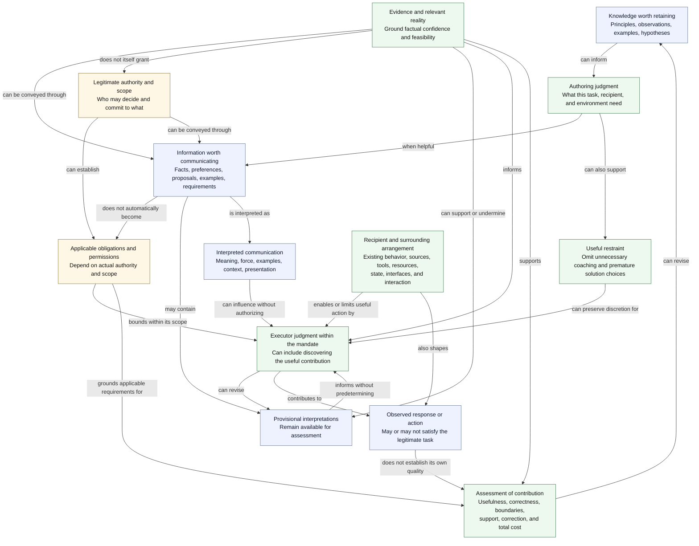
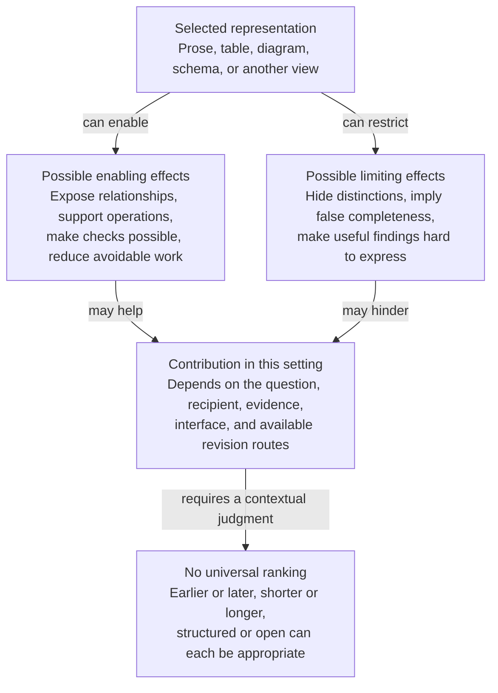
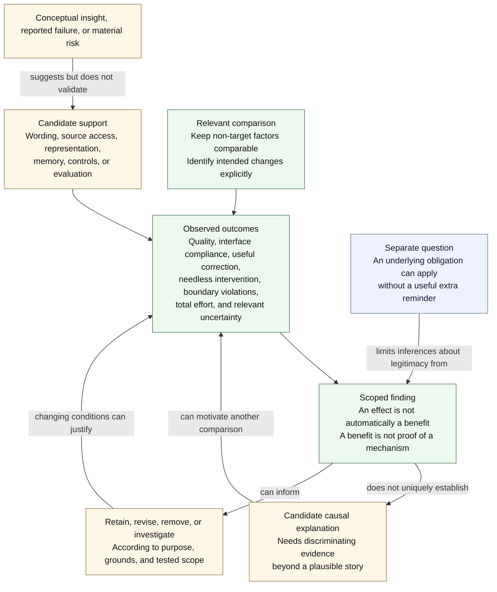
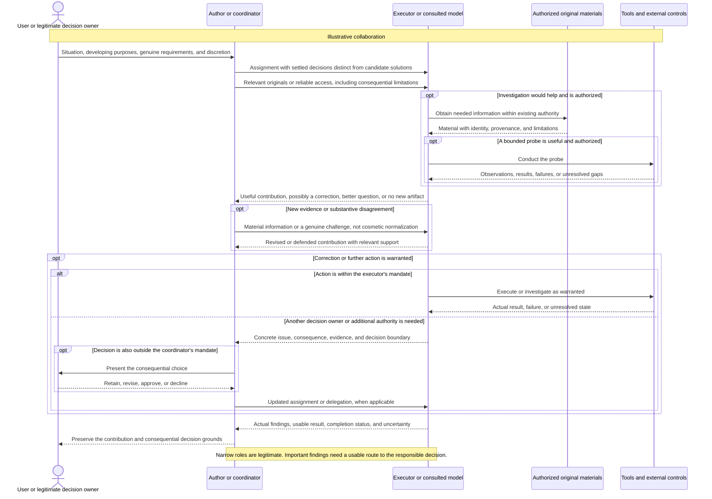
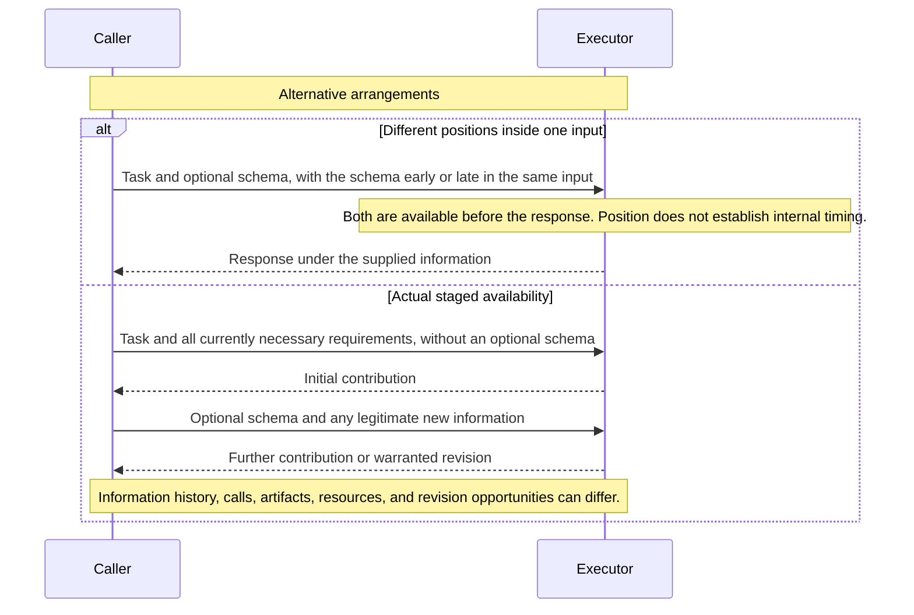
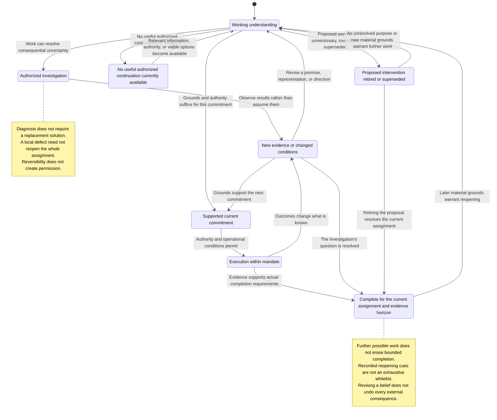
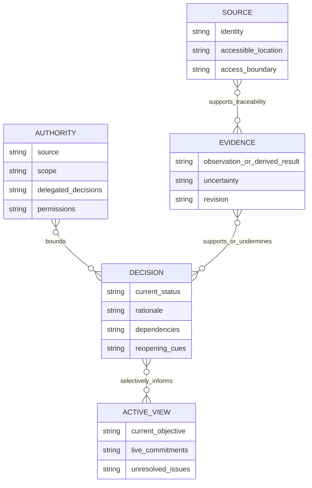
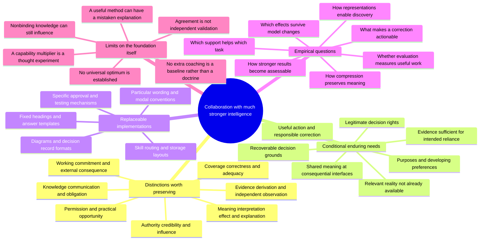

## Contents

Select material by the task and broaden when another concern matters. Reuse unchanged material still available in context; recover consequential grounds after context loss or source changes.

- **1–2:** Scope, evidence status, and capability limits.
- **3–6:** Delegation, authority, communication, and shared meaning.
- **7–8:** Representations, grounding, source access, and preservation.
- **9–11:** Commitment, completion, continuity, and collaboration.
- **12–14:** Discovery, evaluation, warranted reliance, and research.
- **15–18:** Efficiency, instruction authors, transfer, and synthesis.
- **Mermaid Diagram Visualizations; Glossary:** Alternative views and terminology.

# Foundational Knowledge for Intelligent Delegation and Future AI Models

> [!abstract]+ Key Takeaways
>
> - 🧭 **Knowledge, communication, and obligation are different**: A principle can improve an author's judgment without becoming active context, and useful communication does not automatically become binding. Knowledge can improve what an author supplies, omits, or leaves open. The distinction applies to instruction authors as well as executors.
> - 🔓 **The useful contribution can itself require discovery**: Objectives, questions, deliverables, examples, methods, and acceptance criteria can contain provisional solution choices. A WHAT at one level can be a HOW at another; moving to WHY does not automatically escape the problem.
> - ⚖️ **Meaning, capability, credibility, authority, influence, and practical opportunity are distinct**: Better reasoning does not manufacture inaccessible facts or permission. What legitimately governs, what evidence supports, what changes behavior, and what can actually be done need not coincide. Nonbinding does not mean noninfluential.
> - 🗣️ **Intention, interpretation, effect, benefit, and mechanism are different claims**: Communication can change the assignment, clarify it, change presentation, or improve execution. An observed improvement does not establish why it occurred.
> - 🗜️ **Compression depends on shared interpretation**: A short phrase can carry extensive expectations. Brevity does not measure freedom, precision, or retained meaning. Additional explanation can sometimes preserve more discretion by excluding unintended commitments, while unspecified details can represent legitimate delegation.
> - 🗺️ **Representations can enable discovery as well as restrict it**: A view can expose relationships, support operations, and enable useful checks without independently confirming its premises. What it excludes and what it enables are separate questions. Neither maximum openness nor minimum structure is inherently optimal.
> - 🔄 **Commit appropriately, not invariably late**: Real constraints can be useful early. Investigation can supply grounds for commitment, and supported decisions can remain correctable without permanent reconsideration. Revising an interpretation is not the same as undoing its consequences.
> - 🛤️ **Useful correction needs an effective path through the collaboration**: Permission to question is insufficient when evidence is inaccessible, findings cannot be conveyed, or nobody can revise the affected decision. Narrow workers can participate in an adaptable system.
> - 🔬 **Evidence, completeness, and evaluation have scope**: A derivation can add genuine support without being an independent observation. Traceability can establish coverage of a declared inventory without proving exhaustive understanding. Disagreement generates questions rather than automatic discoveries, and a changed score does not necessarily mean better work.
> - 🚀 **Optimize the collaboration, not a proxy for it**: The target is useful, authorized, well-supported work at justified total cost. No additional generic coaching is a legitimate comparison baseline, not a universal optimum. Neither maximum steering, minimum instructions, permanent openness, nor visible sophistication is the objective.
> - 🌱 **Foundations can persist while their implementations disappear**: Relevant reality, legitimate decision rights, shared understanding, usable interfaces, recoverable grounds, and adequate evidence can remain necessary even when familiar prompts, procedures, representations, and storage arrangements become unnecessary.

## 🧜‍♀️ Mermaid Diagram Visualizations

Each diagram is scoped to its heading. An arrow describing a possible influence does not establish a measured causal mechanism. A diagram can make a selected relationship independently understandable without replacing the qualifications and evidence in the prose.

### 🧭 Flowchart: Knowledge, Delegation, Influence, and Assessment

Communication can convey a legitimate requirement or a grant of authority. Information does not acquire binding force merely by being supplied or formatted as an instruction. A nonbinding proposal can influence behavior, and a legitimate requirement remains applicable even when compliance is poor.

The route from sound judgment to useful action depends on practical opportunity, not only permission. Observed behavior does not establish its own legitimacy, usefulness, or explanation.

### 🗺️ Flowchart: What a Representation Enables and Excludes

The working representation and delivery interface need not be identical. A useful derived check establishes what follows from its inputs and assumptions, not that the representation captures every relevant fact.

### 🧪 Flowchart: Evidence About an Intervention

The target of the comparison matters. Studying wording can hold source access fixed; studying source access deliberately changes it. A package comparison can show that an arrangement helps without identifying every contributing component.

A legitimate obligation does not expire because an additional reminder is untested. A material risk or sound design argument can justify provisional support without establishing experimentally demonstrated benefit.

### 🤝 Sequence Diagram: Independent Contribution and Responsible Correction

### ⏱️ Sequence Diagram: Position Is Not Actual Disclosure

Staging an optional representation differs from hiding a genuine safety, authorization, or feasibility constraint. The latter is not justified merely to create an experimental condition.

Neither visible response order nor later input position reveals the chronology of private reasoning. A requested sequence is another intervention, not proof that the corresponding internal sequence occurred.

### 🔄 State Diagram: Investigation, Commitment, and Bounded Completion

Retiring a proposed intervention differs from abandoning an unresolved purpose. It can complete an investigation without settling every broader concern.

These transitions describe warranted changes of status, not guaranteed physical reversibility. Practical reopening depends on retained information, available transitions, dependencies, and authority. Revising a plan may require changing dependent work, correcting claims, or recovering external state where recovery is possible.

### 🗂️ Entity Relationship Diagram: Recoverable Grounds and Active Context

Evidence can have multiple sources. Authority can permit a decision without proving its assumptions, and evidence can support a decision without authorizing an action.

Stored records need not all become active context. Links support traceability without independently validating their contents.

### 🌱 Mindmap: Durable Relationships and Replaceable Supports

## 1. 🧭 Scope, Central Distinctions, and Evidence Status

### 1.1. 📖 Knowledge, Communication, and Obligation

**What is worth knowing, what is worth communicating, and what is worth making binding are three different questions.**

A sound account of excellent judgment does not establish that repeating it improves an already capable judge. Knowledge can help an instruction author omit an unjustified template, provide original evidence, clarify the delegation, choose a useful interface, or offer a suggestion without imposing another obligation on the executor.

Context can inform judgment without prescribing its conclusion. A genuine requirement can remain applicable without repetition. Communication can also legitimately convey a requirement or grant of authority when its source and scope support that act.

The distinction applies recursively. Moving prescriptions from an executor to its instruction writer does not justify them. A more capable author may discover a better assignment or division of work than the author of a general framework anticipated.

A coherent philosophy can still be an ineffective prompt. **A property of good work is not automatically a useful instruction to the worker.**

### 1.2. ⚖️ Different Claims Require Different Grounds

| Claim type                           | Relevant support                                                               | What does not follow by itself                                                  |
| ------------------------------------ | ------------------------------------------------------------------------------ | ------------------------------------------------------------------------------- |
| Definition or conceptual distinction | An argument about meaning, information, evidence, or authority                 | Practical importance in every task or improvement from a particular instruction |
| Normative or design judgment         | Articulated purposes, values, priorities, or legitimate relationships          | A universally optimal implementation                                            |
| Practitioner observation             | Behavior observed or reported in a particular workflow                         | Causal isolation or cross-model generalization                                  |
| Provider guidance                    | Recommendations actually published for a named model, application, or workload | A timeless law or behavioral guarantee                                          |
| Empirical finding                    | Observations under a specified comparison and measurement procedure            | Unlimited transfer or a uniquely identified mechanism                           |
| Mechanistic explanation              | Evidence distinguishing the explanation from plausible alternatives            | Usefulness of every intervention it suggests                                    |
| Research hypothesis                  | A proposed account with distinguishable implications                           | That either the explanation or its proposed intervention is already validated   |

Examples illustrate possibilities; measured prevalence and comparative performance require observations. Proposed study designs require execution before they supply empirical evidence.

Clearer responsibility, relevant evidence access, and discretion over the contribution can support useful work. Rigid enumeration, inherited frames, and mandatory representations can also impose costs. Whether a particular arrangement helps, and which component contributes to that effect, remain separate empirical questions.

Several agents agreeing after sharing material or reading one another's explanations do not create independent confirmation. Agreement does not acquire evidential independence merely by appearing in separate accounts.

Conceptual conclusions depend on their stated arguments and assumptions. Claims about effectiveness, prevalence, transfer, or mechanism require appropriately scoped observations. A cited source supports a claim only within the source's actual scope.

### 1.3. 🔎 Principles and Interventions

Knowing what should govern an executor differs from knowing what influences its behavior or enables a useful contribution. Normative, empirical, and causal questions inform one another without becoming interchangeable.

A distinction can be valuable because it clarifies a consequential ambiguity or improves a future question. It need not be universal to have local value. A once-successful phrase is not foundational merely because it is memorable, and a failed implementation does not by itself disprove the concern it addressed.

A useful descriptive vocabulary can survive a failed explanation. An effective technique can survive an incorrect explanation of its effectiveness. An accurate explanation can motivate an ineffective intervention. These deserve separate treatment rather than one verdict on an entire framework.

Improving a collaboration can produce a changed prompt, better source access, a different interface, an external control, a removed requirement, or no change. There is no presumption that every failure is a prompting failure or every useful explanation must become another instruction.

A property of good work can guide the author's restraint without being transmitted. Conversely, additional guidance can be useful even when its preferred explanation is mistaken. The foundation itself remains open to revision rather than becoming the theory that future findings must resemble.

## 2. 🔭 What a Large Capability Increase Would and Would Not Change

### 2.1. 📏 A Multiplier Is a Thought Experiment

"1000 times smarter" has no defined unit here. Reasoning, knowledge, calibration, reliability, speed, adaptation, and operational reach need not improve together.

The useful hypothetical grants substantially better problem-solving judgment without assuming omniscience, infallibility, unlimited resources, or permission over everything understood.

Under that assumption, generic cognitive prescriptions face a stronger burden of justification: the author may substitute a weaker approximation for superior judgment. It does not follow that every existing default of the stronger model fits every task or relationship.

### 2.2. 🔎 Intelligence Cannot Manufacture a Missing Distinction

Consider two users with identical available task descriptions but different undisclosed confidentiality preferences. If no accessible information distinguishes them, a reasoner cannot reliably identify both actual preferences from the shared description alone. It can infer likely preferences, investigate, or ask; additional computation does not create the distinguishing observation.

This concerns information available to the whole system, not just the current message. Existing context or authorized retrieval may already supply what matters. A continuing information need does not imply repeated prompting.

The same limitation applies when a source summary erases a decision-relevant difference. Greater capability can improve reconstruction where there are grounds for it; it cannot guarantee recovery when distinct situations are indistinguishable in all available information.

### 2.3. ⚖️ Better Reasoning Does Not Supply Every Other Condition

Capability, information, credibility, and authority remain different. Credibility concerns grounds for belief; authority concerns legitimate direction or permission.

A supported finding can concern an action outside the finder's mandate. An authorized decision can depend on a false premise. Predicting consent differs from possessing a standing delegation.

Permission to reconsider a frame does not supply the ability to notice its defect. Strong reasoning does not by itself establish reliable tools, adequate resources, trustworthy sources, operational reliability, or appropriately calibrated confidence.

These questions remain distinct even when a future system improves several together. An improvement in one property does not automatically establish improvement in every other condition of useful collaboration.

### 2.4. 🌱 Needs Can Persist While Their Expressions Disappear

Relevant grounding, developing purposes and preferences, legitimate delegation, usable interfaces, recoverable grounds, and adequate evidence remain needs wherever the collaboration depends on them and they are not already supplied.

Their implementation may move from repeated prose into shared context, tools, permissions, records, or interaction. Generic reminders can become redundant while a broader mandate requires richer task-specific information.

Broader capability can mean less need to prescribe methods and more need to supply the local circumstances of broader responsibilities. Support can lose, retain, or gain value as the model, task, information, tools, or evaluation changes.

No sentence, notation, folder layout, or reasoning sequence is shown to persist universally. There is no established monotonic relationship between capability, autonomy, and useful prompt length. A foundation can remain valuable in the relationship's design after its old textual expression becomes unnecessary.

## 3. 🎯 Delegation Can Include Discovering the Work

### 3.1. 📦 WHAT, HOW, and WHY Are Relational

A dashboard is an implementation outcome and a possible method for helping someone notice consequential changes. An implementation plan assumes implementation is warranted. Asking for three architectures fixes both a contribution type and a quantity. Asking for a prompt rewrite can exclude discovering that the underlying failure is inaccessible evidence.

Objectives, questions, deliverables, decompositions, methods, examples, comparison criteria, and evaluations allocate decisions. An output contract can contain a solution design. Freedom over internal reasoning is narrower than freedom to discover that the expected artifact is the wrong contribution.

Moving to WHY may expose a purpose but does not guarantee the correct frame. A rationale can contain a mistaken causal account, inadequate proxy, or objective that is itself open to development. Broader abstraction is useful when it reveals a consequential issue, not because every task benefits from becoming a larger inquiry.

The durable distinction is **what has genuinely been settled versus what remains a hypothesis about what would help**.

### 3.2. 🔓 Genuine Requirements Can Coexist with Open Judgment

A requested sonnet, an actual machine interface, a submission artifact, or an authorized design decision can legitimately constrain the result. An instruction writer may be commissioned to select a design and delegate its implementation.

A convenient template does not become a requester requirement through its heading or repeated use. Equally, an executor cannot silently downgrade an explicit requirement just because it prefers another task. Challenging a fixed requirement does not automatically grant permission to replace it.

An output interface constrains what must be delivered; it does not logically require the executor's entire understanding to fit the same categories. A fixed interface can leave substantive conclusions open when it can express the legitimate possibilities. If it cannot express a consequential finding, the arrangement may need another authorized channel or a decision about the interface itself.

Whether a particular model or workflow conflates its working understanding with its delivery interface is a behavioral question, not a logical consequence of having a schema.

Freedom to assess an assignment also includes freedom to agree and execute directly. Mandatory reframing, disagreement, creativity, or alternative generation can predetermine the contribution just as strongly as a fixed implementation plan.

### 3.3. 🌿 Purposes Can Develop Through Collaboration

A user may begin with dissatisfaction rather than a finished objective. Seeing alternatives and tradeoffs can change what they regard as worthwhile. Another intelligence can reveal that a task should be eliminated rather than automated, or that a different opportunity better serves the developing purpose.

Respecting agency does not freeze the first wording. It keeps consequential choices connected to legitimate purposes, the user's developing understanding, and the actual delegation. Revealing a possibility expands informed choice; silently imposing a value judgment substitutes the executor's priorities.

A broad mandate can authorize investigation and redirection, not merely private doubt or a request for permission to exercise ordinary expertise. It can also allow the executor to conclude that the original formulation is sound and execute it directly.

Novelty, objections, and reframing are not obligatory evidence of judgment. The extent of autonomous action depends on the decision rights already granted.

### 3.4. 🛠️ Expertise Should Not Require Password-Like Jargon

A user should not need to name the appropriate library or every professional practice to obtain competent work. Tool and technique selection can belong to ordinary expertise.

A label such as DRY, KISS, SOLID, or TDD can communicate a real requirement, a useful suggestion, or an inappropriate generalization. Expertise includes selecting and adapting practices rather than applying a catalog regardless of context.

A less capable participant can still supply a crucial fact, local preference, or good idea. **Freedom to assess a contribution matters more than freedom from encountering it.**

A prohibition on methodological suggestions would discard useful collaboration alongside unnecessary prescription. The author's general reasoning capability does not determine the value of every fact or preference they supply.

## 4. ⚖️ Authority, Credibility, and Practical Discretion

### 4.1. 🔐 Autonomy Is an Allocation, Not One Setting

Analysis, framing, implementation, response form, spending, protected-state changes, external communication, and goal changes can be delegated differently.

Broad intellectual initiative can coexist with narrow authority to create external effects. A standing mandate can also authorize substantial action without repeated approval.

Technical access is not permission. Confidence, predicted consent, and reversibility do not themselves authorize an action. Reversibility can reduce some consequences of error without changing who may decide.

Conversely, asking for approval is not inherently safer or more competent when the necessary discretion has already been granted. An unnecessary approval request can return ordinary expert decisions to someone who delegated them.

Genuine safety constraints and legitimate external obligations remain relevant without turning every imaginable concern into a new boundary. Hard requirements delimit acceptable work; they are not automatically preferences that can be outweighed by a better aggregate score.

### 4.2. 🧾 Truth and Obligation Can Be Distorted Separately

An assumption can become accepted as fact without sufficient evidence. A recommendation can become mandatory without sufficient authority. Both can restrict later work, but their missing justifications differ.

An authorized plan can rest on a false premise. A correct conclusion can concern an action outside its discoverer's role. Stronger instruction following does not repair the premise, and better evidence does not grant the missing permission.

An instruction writer may legitimately make design choices within its mandate. Misrepresenting those choices as requester-set necessities obscures their origin and who may revise them. Faithful delegation preserves the distinction between transmitting requirements and creating an authorized design.

Authority also differs from obligation strength. An authorized source can express a suggestion, default, permission, or requirement. More emphatic wording from a source lacking the relevant authority does not elevate its standing.

Repetition, polish, confidence, and placement in a plan supply neither factual justification nor legitimate authority. The assistant's replacement frame can undergo the same undeserved promotion as the user's original proposal.

### 4.3. 🚧 Necessity Does Not Create Authorization

A necessary dependency establishes what achieving an outcome would require. It does not authorize that dependency.

If a task requires an action outside current permissions, the finding exposes a decision boundary rather than dissolving it. The dependency does not revise the mandate automatically.

The appropriate conclusion may be that the present mandate is infeasible, that a narrower outcome is available, or that another authority must decide whether to change the arrangement.

Feasibility, desirability, and authorization remain different questions. Evidence that an action is necessary or informative is not itself permission to perform it.

### 4.4. 🛤️ Nominal Permission Is Not Effective Opportunity

An executor may be allowed to find a better design but lack the relevant evidence. Another may discover a defect but be unable to express it through the interface. A third may report it, but nobody responsible can revise the affected commitment.

Permission to exercise judgment therefore does not establish the practical ability to make that judgment useful. Information access, discoverability, resources, communication routes, acceptance criteria, dependencies, and decision rights can each matter without forming a mandatory checklist for every task.

The useful system-level question is whether a consequential finding can affect the appropriate decision. More permissions or more alternatives mentioned in a prompt do not by themselves establish that property.

Practical discretion concerns usable opportunity, not merely the nominal size of the authorized option space.

### 4.5. 🧩 Bounded Workers Can Support System-Wide Adaptability

A worker assigned to reproduce a bug, extract specified fields, or validate a schema need not reconsider the entire business process. Broader judgment can belong to a coordinator. An instruction author may also legitimately select the design when that is its assignment.

Local scope and system-wide adaptability are separate properties. The problem is not division of labor; it is treating local completion as proof of global adequacy or leaving a consequential finding with no appropriate recipient able to act on it.

The solution is not maximum discretion for every participant. Appropriate division of responsibility can preserve both narrow interfaces and broader correction.

A concern outside a worker's role may be within its coordinator's role. It does not automatically require returning every decision to the user, and not every observation warrants escalation.

### 4.6. 🧭 Different Kinds of Closure Have Different Roles

A permission set can legitimately exclude unauthorized actions. A machine consumer can accept a finite set of fields. A hypothesis list does not become exhaustive in the same way merely because only three explanations were written down.

Closure valid for one interface should not silently describe reality beyond it. Conversely, an open space of explanations does not imply an open permission boundary.

An informed choice need not follow consideration of every imaginable alternative. It can remain settled enough for action while staying responsive to new material evidence, contradiction, changed stakes, or observed failure.

Mere disagreement or the availability of another idea does not erase that settlement. Supported stability and warranted correction can coexist.

## 5. 🗣️ Communication, Responsibility, and Behavioral Influence

### 5.1. 📜 What Governs Is Different from What Influences

Authority determines which directions legitimately apply. Credibility concerns grounds for belief. Behavioral influence concerns effects on actions or outputs. Practical opportunity concerns the information, resources, tools, and interfaces available to turn a judgment into useful work.

A nonbinding example can influence an answer. A valid instruction can be misunderstood. Credible information can be irrelevant to the current decision. An authorized alternative can remain undiscoverable or impossible to enact.

Making status explicit can remove ambiguity without guaranteeing useful behavior. **Making something nonbinding does not make it noninfluential, and making something influential does not make it justified.**

For research, *steering* can describe a specified intervention in communication or the surrounding arrangement intended to influence behavior. It need not imply a discrete internal actuator, fixed semantic operator, known mechanism, or established benefit.

### 5.2. 🔬 Intention, Interpretation, Effect, Benefit, and Explanation

Communication can describe facts, establish preferences, ask questions, propose approaches, impose requirements, quote another speaker, or grant permission. The same words can perform different roles depending on who supplies them, to whom, and in what relationship.

| Question                 | What it concerns                                              |
| ------------------------ | ------------------------------------------------------------- |
| What was intended?       | The author's intended content, force, scope, and purpose      |
| What was understood?     | The recipient's interpretation, which may itself be uncertain |
| What changed observably? | Actions, outputs, resource use, and downstream consequences   |
| Did the change help?     | The legitimate assignment, quality requirements, and costs    |
| What caused it?          | A mechanism supported by discriminating evidence              |

Interpretation may itself be inferred from behavior and remain uncertain.

A cue intended to improve evidence handling might produce more cautious language without better accuracy. "Forensic review" might improve detection, elicit more effort, change tone, or increase unsupported accusations. Those are possible outcomes, not properties guaranteed by the phrase.

Describing an answer as forensic does not measure the process that produced it. An attractive description of an internal mechanism is not evidence that the mechanism occurred.

### 5.3. 🎯 A Communication Change Can Change the Assignment

Adding an audience, budget, confidentiality priority, or evidential standard can change what counts as a good result. Granting discretion changes permissible choices. Supplying a document changes the available evidence.

A more useful response after a prompt revision may reflect a changed intention, clarification of the same intention, additional information, better execution of an unchanged task, or a change in presentation. These can all matter, but they support different conclusions.

Adding "brief," "forensic," or "publication-ready" may alter scope, priorities, or standards. A suitable response can demonstrate successful communication of a different intention without demonstrating improved performance on an unchanged task.

Task equivalence concerns meaning, purpose, force, scope, permissions, information, and communicative role. Dictionary similarity or surface resemblance is insufficient. A quotation and a direct request can use identical words without being equivalent instructions.

The research target is appropriate responsiveness to meaningful changes and reliability across incidental ones. That does not require identical outputs; several creative or technical contributions may satisfy the same purpose.

### 5.4. 📡 Formal Priority Is Not a Stable Ranking of Influence

Behavioral influence need not form one stable hierarchy. An example might shape style, a source factual conclusions, and a schema serialization. Their effects can interact rather than admit a single ordering of dominance.

Salience, relevance, credibility, legitimate precedence, and observed effect remain separate properties. An example that clarifies an underspecified request has not necessarily overridden it; establishing an override requires a genuine conflict with an applicable requirement.

No universal priority order among architecture, wording, examples, source access, and controls has been established. A small wording change can alter scope or obligation, while a changed tool can make a prompting workaround unnecessary.

Similar outputs can have different causes. An alternative may be absent because it was not discovered, was judged irrelevant, was legitimately excluded, or could not be conveyed. The final answer usually does not uniquely identify which explanation applies.

### 5.5. 🔎 Similar Outputs Can Reflect Different Restrictions

An unnecessary dashboard can result from a believed requirement, missing evidence, a missed alternative, an unsupported assumption about user priorities, or an interface that cannot express the useful finding.

| Possible restriction                      | Distinguishing question                                                          | What does not automatically follow                                        |
| ----------------------------------------- | -------------------------------------------------------------------------------- | ------------------------------------------------------------------------- |
| Genuine requirement                       | Is producing this artifact actually part of the mandate?                         | That the executor cannot understand alternatives                          |
| Interpretation of ambiguous communication | Which decisions does the recipient understand as settled?                        | That the author's intended force was communicated successfully            |
| Missing evidence or access                | Was information needed for another conclusion available or obtainable?           | That permission to question could compensate for its absence              |
| Influence without obligation              | Does a nonbinding example change behavior under an otherwise comparable mandate? | That the example became authoritative or its internal effect is known     |
| Contribution or acceptance interface      | Can a warranted correction be expressed, received, and accepted?                 | That an omitted finding was never discovered                              |
| Operational dependency or external effect | Can an authorized revision still be carried out through an available transition? | That the original interpretation is correct because changing it is costly |

These are possible distinctions, not a diagnostic sequence or exhaustive causal account. Several can operate together.

An observed restriction in output is not proof that no alternative was considered. A claim that alternatives were considered is not proof of adequate investigation. Descriptions such as anchoring or representational commitment remain explanations to assess, not observations supplied by the wording of an answer.

### 5.6. 🔒 Provisional Decisions Can Acquire Undeserved Status

A suggestion can become a plan, a subtask, an expected artifact, and finally the evaluation target. Alternatives become incompatible with completion without a new authorized decision explicitly settling the original proposal.

Summaries, diagrams, conversations, and records can preserve a conclusion while losing its tentative status. Repetition, familiarity, polish, and prior effort do not establish truth or authority.

A second possibility is influence without mistaken authority. Participants may understand that a suggestion is optional and still organize the work around it. Clarifying its status addresses the normative ambiguity; whether it removes the behavioral effect is an empirical question.

Unearned authority is consequently a useful failure mechanism, not a complete demonstrated theory of frame lock. Permission to reconsider does not supply evidence, search, skill, or sound execution. The explanation itself must not become the next frame that no observation can challenge.

### 5.7. 🏗️ Intervention Scale Does Not Establish Its Value

A structural defect may require a change of assignment, permissions, source access, or acceptance criteria. A consequential ambiguity may be resolved by one word.

Wording can itself establish a decision boundary, so lexical and architectural changes are not independent levels in a universal priority order. Changing "required implementation" to "candidate implementation" changes status, not merely style. Polishing prose cannot supply inaccessible data.

Neither observation implies that one intervention class always matters more than another. A source of influence is best described precisely enough to investigate its contribution.

There is no demonstrated complete operator tuple, fixed algebra of cues, or universally optimal density of instruction. Metaphors such as gradients, activation, or bandwidth do not establish a mechanism merely by offering an attractive description.

### 5.8. 📌 Responsibility and Force Are Not Created by Grammar

Direct address can clarify responsibility. "Instructions should be clear" leaves its addressee more implicit than a direction addressed to the author, but that comparison does not isolate direct address, salience, role clarity, or another cause as the explanation of any benefit.

Declarative statements can also govern when their applicability is established. A role statement can establish responsibility without making every sentence start with "You." Precise conditions need not enumerate every possible scenario.

Authority and intended force differ. A low-authority source can say "you must"; a legitimate decision owner can say "you may." Quoted text does not become an instruction to the current recipient simply because it uses imperative language.

Ordinary language can express an obligation without a special vocabulary. Syntax helps communicate a relationship; it does not independently create legitimacy, evidence, or enforcement.

Scope includes the responsible role and system layer. Guidance governing an instruction author does not automatically become the downstream executor's task or a format imposed on the surrounding explanation.

### 5.9. 🧾 A Modal Vocabulary Is an Optional Convention

The following sentence illustrates an optional convention for obligation strength and downstream responsibility. It is an example, not a directive issued by this note:

> You SHALL follow applicable instructions according to their stated force - SHALL means required, SHALL NOT prohibited, SHOULD a strong default, and MAY permitted within granted authority - and use the same vocabulary when directly expressing obligations and permissions to another AI executor.

Such a convention can be part of an authorized instruction system. Its mere presence in a knowledge resource does not make it binding on every reader or establish universal effectiveness.

Accurate force differs from maximum force. Converting SHOULD to SHALL can turn a useful default into an inappropriate absolute. MAY does not require exercising an option, create authority the speaker lacks, or require a new permission statement for routine actions already authorized.

A prohibition stated in ordinary language does not become optional because it lacks capitalized keywords. A quoted SHALL does not govern the current recipient merely because it is capitalized.

Direct address, declarative specifications, conditional expressions, and schemas are candidate communication means. Their benefits and costs can be studied without inheriting a complete authoring framework. Clear language can make a bad requirement more effectively restrictive; clarity does not justify the requirement.

### 5.10. 🌐 Useful Communication Cannot Avoid All Influence

Examples, suggestions, rationales, and proposed methods select what to make available and salient. That is part of communication's usefulness, including communication from a less capable participant.

The relevant concern is whether a contribution improves shared understanding or unnecessarily settles something the recipient was engaged to discover. A non-exhaustiveness label does not ensure that omitted possibilities will be found. A prohibition on every suggestion would not ensure better judgment either.

Preserving judgment leaves room for warranted revision, useful agreement, and direct execution. It does not require permanent dissent, limitless exploration, or freedom from all framing.

## 6. 🗜️ Semantic Compression and Shared Understanding

### 6.1. 📦 Short Phrases Can Carry Extensive Expectations

**Prompt length is not a measure of how much a prompt prescribes.**

"Production-ready" may imply reliability, deployment, security, support, testing, or maintainability, with different interpretations across participants and settings. Its exact content is not established merely by naming the label.

Compact language can efficiently invoke genuinely shared expectations. It can also conceal ambiguity or unrequested obligations. Replacing a paragraph with a word does not necessarily remove cognitive scaffolding; it may hide the specification inside an association.

Conversely, a longer explanation can identify the actual property while avoiding unrelated expectations. More words can communicate fewer unintended commitments. Token count, retained meaning, interpretive uncertainty, and constraint burden are different quantities.

The useful question is whether consequential meaning survives at acceptable risk and cost, not whether a cue packs the greatest apparent influence into the fewest tokens.

### 6.2. 🔬 A Compact Cue Is Not Necessarily an Internal Macro

A proposed expansion of a word into several primitive behaviors is the author's interpretation, not evidence of a deterministic internal procedure.

Expanding "forensic" into a list of practices states one possible intended meaning. It does not prove that the recipient applies those practices or that those practices explain an observed benefit.

The expansion may also add requirements that the compact expression did not unambiguously contain. Comparing a term with its explicit expansion is useful precisely because equivalence cannot be assumed.

A cue can remain useful even when its original mechanistic explanation is wrong. Its communicative value, behavioral effect, and proposed internal operation deserve separate assessment.

### 6.3. 🤝 Shared Meaning Does Not Require Identical Internal Models

Participants can coordinate without using the same decomposition. A user may care about delayed orders while an expert understands the process through a much richer model.

Sufficient agreement is needed about consequential purposes, interfaces, and commitments, not necessarily every internal category. A stronger executor need not accept the author's decomposition as the price of compliance.

A more capable executor may need less explanation of a technical concept and still need local facts determining its use. It may recognize ambiguity and repair it through interpretation, a targeted question, or authorized investigation. Greater intelligence does not make every local convention common knowledge.

Professional vocabulary can assist collaboration without becoming a test of the user's sophistication. Even familiar terms may require grounding when several legitimate conventions fit or their interpretation materially changes the work.

### 6.4. 🧷 Examples Convey More Than Their Intended Lesson

An example can clarify a convention while also carrying incidental features. What it demonstrates differs from everything it happens to contain.

Copying a detail does not by itself establish whether the detail was understood as required, informative, or merely convenient. The same example can clarify one aspect of the request while making unrelated choices more salient.

The author's intended lesson, the recipient's interpretation, and the example's observed influence need not coincide. Distinguishing them does not require avoiding examples; it makes their contribution a more precise question.

### 6.5. 🌿 Unspecified Detail Can Be Deliberately Delegated

An omitted detail may be irrelevant, already available, recoverable, intentionally left to expertise, or consequentially ambiguous. These are different situations.

Complete explicitness is neither possible nor a useful universal objective. A brief can deliberately leave methods or response form open. Leaving implementation unspecified may be a grant of discretion rather than an incomplete assignment.

Clarification has value when plausible interpretations would change consequential work enough to justify its cost. It is not automatically required whenever multiple choices exist.

Shared meaning can develop through interaction. An executor with adequate information and authority can proceed without turning every discretionary choice into a missing requirement.

## 7. 🗺️ Representations, Constraints, and Derived Support

### 7.1. 📡 Constraints Can Enable Useful Discovery

Permissible actions, expressible answers, recognized possibilities, accessible evidence, affordable computation, and remaining room for improvement are different quantities. They do not constitute a fixed pool of search bandwidth from which each constraint subtracts.

An offline requirement eliminates many approaches while making useful search more tractable. A shared interface restricts presentation while enabling components to cooperate. A tightly specified transformation can be exactly the right task.

Apparent openness can instead leave a task underspecified or make action needlessly costly. Authorization without adequate information or resources can add little practical discretion.

The value of a constraint depends on what it excludes, what it enables, and its legitimate role. A smaller nominal option space need not imply a smaller effective ability to solve the problem. Nor does a large set of theoretical possibilities establish that any useful option is practically reachable.

### 7.2. 🔎 Structure Can Make a Problem More Solvable

Prose, tables, graphs, schemas, and taxonomies foreground some distinctions and omit others. Selectivity is necessary; false claims of completeness are not.

A timeline can reveal an ordering problem. Common units can expose an invalid comparison. A dependency graph can make a cycle inspectable. A preliminary representation can make an experiment possible even if that experiment later overturns it.

These examples distinguish restricting expression from enabling useful reasoning. A narrower representation can improve the ability to discover a correct result while hiding another distinction the task needs.

A schema can fix syntax while leaving substantive findings open. It can also impose a conceptual restriction if it cannot express uncertainty, an exception, or a legitimate unexpected result. The number of fields does not by itself reveal which role it performs.

Neither maximum openness, minimum structure, early structure, nor late structure is a general optimum. The relevant questions concern what a view settles, what it enables, what it excludes, and what revision remains possible.

### 7.3. 👥 Different Beneficiaries Can Need Different Views

A diagram can help a person inspect relationships. A structured representation can help an agent retrieve or update them. A formal object can let a tool check a property.

These benefits may require different artifacts. The human-facing view need not be the working representation, and one artifact need not serve every beneficiary.

A useful interface can remain stable while the working account changes. A temporary model can be replaced without changing the authorized purpose. The existence of a representation does not prove that anyone used it effectively or that it improved the result.

A visualization can also be a genuine deliverable for explanatory, aesthetic, or coordination reasons without improving the agent's own reasoning. A notation's syntax and rendering behavior are separate from whether a particular use improves understanding or judgment. ([6][6], [7][7])

Merely naming a diagram type can make an unnecessary artifact salient. Mandatory disclaimers or unknown-node placeholders can likewise become ceremony. Their value depends on the understanding, operations, or checks they support rather than their presence as recognizable signs of care.

### 7.4. 🧮 Derived Insight Is Not Independent Observation

Re-expressing a premise does not independently corroborate it. A graph drawn from an assumption remains dependent on that assumption. An arrow alone does not establish causation.

However, transformation and analysis can reveal warranted consequences not previously recognized. A valid derivation, calculation, proof, or executable check can add genuine support without adding a new external observation.

Detecting a cycle establishes a property of the supplied dependency representation. It does not establish that all real dependencies were recorded. Both statements can be true: the check adds useful information about the representation, and its relevance to the world depends on the representation's adequacy.

**Lack of independent observation does not imply lack of evidential value.** The distinction is between deriving or checking something substantive and treating a restatement as independent confirmation.

A proof's validity and the adequacy of its premises or formalization remain separate questions. Strong support within explicit assumptions does not establish that those assumptions capture every intended concern.

## 8. 📚 Grounding, Source Access, and Information Preservation

### 8.1. 📂 Access to Reality Is Different from Access to an Interpretation

A stronger executor cannot inspect evidence an intermediary removed and made inaccessible. A performance-focused summary can omit the fact that a computation is unnecessary. Freedom to question the conclusion does not restore the omitted observation.

Original materials or reliable access preserve distinctions the intermediary did not recognize. Summaries can orient the recipient and reduce retrieval cost without becoming its sole account of consequential evidence.

Relevant information can be worth supplying even when inferable or rediscoverable. Local rationale, current constraints, and known dependencies can prevent costly reconstruction or divergent interpretations.

Inferability does not determine the value of communication by itself. Providing evidence differs from substituting the author's preferred reasoning for the recipient's judgment.

### 8.2. 🧷 Content, Status, Access, and Trust Are Different

A path is not a supplied file. Existence is not current access. Project membership is not proof that this executor has the current revision.

Information can be stored, discoverable, available in active context, or actually consulted. Identity, availability, currency, provenance, scope, and consequential omissions can change what is justified.

Available source material is not automatically credible. Credible source material is not automatically authoritative over the recipient. Evidence and instructions can arrive together without sharing the same status.

Compression can retain a topic while dropping "tentative," "superseded," or "authorized only for this experiment." "We could migrate" is not equivalent to "we will migrate."

Losing a condition, uncertainty, supersession, or permission limit can change the assignment while appearing to preserve its subject. Status, scope, and origin are part of consequential meaning, not optional historical decoration.

### 8.3. 🗜️ Compression Has a Logical Limit

Suppose a summary function $c$ maps two source situations to the same summary, while a later decision $d$ requires different outcomes:

$$
c(s_1)=c(s_2), \qquad d(s_1)\ne d(s_2).
$$

An executor given only that summary, with no other distinguishing information, cannot reliably recover the correct source-dependent decision in both situations. Additional reasoning cannot restore a distinction absent from everything available to it.

This is an information limit under the stated conditions, not a claim that every summary is defective. A summary can be entirely adequate for one decision and inadequate for another.

More capable reasoning can use retained distinctions better but cannot guarantee reconstruction of differences erased from all accessible evidence. Sufficiency is relative to the questions and decisions the summary must support, not a guarantee that it preserves every distinction needed for unforeseen uses.

Future questions may not be known during compression. Preserving reliable access to detail can therefore be more useful than claiming that the current summary will remain sufficient.

This does not imply loading all originals into every interaction or retaining material outside legitimate access and confidentiality boundaries. Retrieval must actually make the distinguishing information available when it matters; nominal storage alone does not solve the problem.

### 8.4. 🪶 Adequate Grounding Is Not Maximum Context

An indiscriminate dump can include stale, duplicate, irrelevant, or unauthorized material. A narrow summary can omit exactly what would overturn the current interpretation.

Storage, discoverability, actual access, active context, and consultation are different resources. More retained material does not automatically mean better available grounding.

A concise orientation with reliable retrieval can be more useful than either extreme. Its value depends on finding what matters, not merely reducing the initial token count.

Additional context can improve a result, burden it, or do both in different parts of a task. The relevant concern is whether decision-relevant reality remains available with its important limitations understood.

Neither more material nor less material alone establishes better grounding. Saving context by making consequential evidence unreachable is not an improvement on an otherwise unchanged task.

### 8.5. 🧭 Routing Is an Access Decision, Not a World Model

A router can select a resource without defining the only possible explanations. Narrow skill applicability can prevent irrelevant procedures from being loaded while leaving substantive inquiry open. No matching skill can be an appropriate result.

Progressive disclosure is one possible arrangement, not a universal solution. An index that hides an unanticipated but relevant source has reduced context by removing an opportunity to be correct.

A useful routing system makes access possible without turning its categories into a closed ontology. Its value depends on what remains discoverable and correctly interpretable, not only the amount of material initially loaded.

## 9. 🔄 Timing, Commitment, and Bounded Completion

### 9.1. ⚓ Different Commitments Have Different Grounds

A working representation organizes understanding. A commitment settles something for action, coordination, or acceptance. These can influence one another without being identical.

| Commitment                             | What may need to change when it fails                  |
| -------------------------------------- | ------------------------------------------------------ |
| An authorized requirement              | The mandate or decision of the legitimate owner        |
| A working hypothesis or representation | The account used for inquiry or execution              |
| A stated conclusion                    | The claim, its support, and others' reliance on it     |
| A plan with dependents                 | The plan and affected coordination                     |
| An implementation                      | The artifact, its operation, and relevant dependencies |
| An external action                     | The resulting state, where recovery is possible        |

A tentative-looking plan can become expensive to revise once people, agents, tests, or budgets depend on it. A detailed description can remain cheap to replace when nothing consequential relies on it.

Textual firmness does not measure practical reversibility. A representation, hypothesis, requirement, implementation, and completed external effect are different objects of revision.

Timing, strength, scope, duration, cost of deviation, and revision routes are useful descriptive questions. They are not an established complete coordinate system or a reason to make every boundary soft.

### 9.2. ⏱️ Position, Availability, Applicability, and Reliance Differ

Several meanings of "before" and "after" can be hidden in a claim that a representation is introduced late.

| Distinction            | Example                                             | What it does not establish                              |
| ---------------------- | --------------------------------------------------- | ------------------------------------------------------- |
| Textual position       | A schema appears at the end of one request          | That it was unavailable during earlier reasoning        |
| Intended applicability | The request assigns a schema to the final response  | That it had no earlier influence                        |
| Actual availability    | A schema is disclosed in a later interaction        | That any benefit comes only from delayed commitment     |
| Observable reliance    | Subsequent work is organized around a chosen plan   | The exact internal moment at which the plan was adopted |
| External commitment    | Messages, resources, or dependent work have changed | That revising the interpretation reverses those effects |

Material at the end of an initial prompt is still supplied before the response. Serializing an analysis before an artifact changes visible output order, not demonstrably the chronology of internal decisions.

An instruction to defer formatting is another intervention rather than proof that deferral occurred. A self-description does not independently validate the claimed sequence either.

Moving identical text studies position. Changing scheduling language studies that instruction. Withholding an optional representation until a later turn studies an interaction with a different information history.

Calls, intermediate artifacts, resources, and revision opportunities may also differ. These can be valid package comparisons without isolating one hidden mechanism.

### 9.3. 🧩 Appropriate Commitment Is Not Always Late Commitment

Early knowledge of real constraints can avoid infeasible work. Discovering an offline requirement, privacy boundary, budget, protected-state limitation, or consumer interface only after dependent work begins can cause unnecessary rework or an invalid solution.

A provisional structure can also make coordination or an informative experiment possible. Conversely, a rigid late requirement can exclude an important conclusion. Neither early nor late structure is intrinsically superior.

Useful questions include what the commitment settles, its scope, its grounds, when other work begins to depend on it, and what revision would involve.

**The timing, strength, scope, duration, and consequences of a commitment should fit its purpose, authority, evidence, and dependencies.** This is a design judgment about justified commitment, not a universal instruction to delay, soften, or repeatedly reopen decisions.

Information should not be withheld merely to enact a preference for late structure. Nor should a plan's later stages be treated as justified commitments merely because they have been named.

### 9.4. 🔧 Revising a View Does Not Undo Every Consequence

A plan can remain intellectually provisional while messages have been sent, money committed, or other work built around it. Calling the plan revisable does not reverse those effects.

Revising a hypothesis differs from retracting a public promise or recovering disclosed information. Practical reopenability depends on available transitions, retained information, authorized actors, and the cost of managing dependencies.

Reversibility can be partial rather than all-or-nothing. Useful correction concerns the relevant understanding and, where necessary, the consequences of acting on it.

A better explanation need not change the action: new evidence may improve understanding while leaving the same decision warranted. Equally, an unchanged label can conceal that the underlying justification has failed.

Correction concerns relevant grounds and consequences, not simply whether a document was edited.

### 9.5. 🧪 Work Can Produce the Evidence Needed to Judge Direction

A prototype can show that a proposed component is unnecessary. An attempted analysis can reveal missing evidence. An authorized experiment can distinguish approaches that further conversation cannot resolve.

Execution is therefore not always downstream of a fully validated frame. It can help discover whether the frame is sound.

Useful investigation differs from avoidable commitment that compounds an unresolved issue. A probe can affect a decision only when the surrounding arrangement permits the decision to change.

Naming future steps in a plan does not justify committing to them before their evidential dependencies are met. An evidence horizon can support an immediate investigation while leaving later implementation unsettled.

A probe is not meaningfully corrective when dependent decisions have already been insulated from its findings.

### 9.6. ⚠️ Materiality Does Not Imply Prior Discoverability

A material defect is a problem whose correction could change the objective, approach, commitment, risk, or truth of the result. Its importance does not prove that it could have been found before substantive work began.

Proportionate scrutiny before consequential commitment is more defensible than an implied guarantee of exhaustive foresight. Its value depends on the stakes, available evidence, uncertainty, reversibility, and cost of delay.

Evidence that an action could resolve uncertainty does not authorize the action. Reversibility may reduce consequences without supplying permission.

The distinction prevents two opposite errors: treating every undiscovered defect as proof that a mandatory preflight ritual was omitted, and using uncertainty as a reason to ignore a problem already apparent and correctable.

### 9.7. 🛑 A Diagnosis Need Not Include a Replacement

Establishing that evidence does not support a claim can be a complete and useful finding even when no replacement claim is defensible. A failed dependency can be identified before a substitute exists.

Demanding a complete rescue plan before acknowledging a defect can encourage invented alternatives. A narrower commitment, discriminating test, clarification, responsible handoff, or honest stop can be the best available contribution.

A local defect need not derail sound work. A foundational defect should not disappear beneath local polishing.

The appropriate correction follows the consequence, not a ritual of always zooming out, always objecting, or always continuing within the initial assignment.

### 9.8. ✅ Stability, Reopenability, and Completion Are Compatible

Coherent work needs temporary concentration. Choosing an approach does not claim it is the only one. Pausing investigation of an alternative does not assert that it is impossible or permanently unreachable.

An informed choice can be settled enough to act on without exhaustive search. New material grounds can warrant reconsideration; merely imagining another option does not.

Recorded reopening cues preserve useful reminders without defining the only admissible reasons to change course. Reopenability does not require permanently investigating every alternative.

Completion belongs to the actual mandate and current evidence horizon. Retiring an unnecessary proposal can finish an investigation while leaving a broader purpose unresolved. Meeting a real implementation requirement can finish that assignment even though other improvements remain possible.

Further possible work does not create an unlimited duty to continue. A first attempt does not establish completion when the mandate includes making the result usable.

"No useful authorized continuation is currently available" is a meaningful status, distinct from verified success and from a claim that no future solution exists.

## 10. 🗂️ Continuity, Recoverable Grounds, and Scoped Completeness

### 10.1. 🧠 Different Information Has Different Lifetimes

Current governing decisions, live operational issues, historical rationale, and a chronological record of everything that happened serve different purposes.

Combining them can bury unresolved work beneath a changelog or make abandoned proposals look current. Completed work and current operational uncertainty do not have the same retention or presentation needs.

Decision grounds can include why a choice was made, its evidence and assumptions, dependencies, accepted tradeoffs, and relevant authority. A short sentence may preserve enough; a consequential and difficult-to-reconstruct decision can justify more detail.

An architectural decision record is one specialized format, not the foundation. Not every decision needs a standalone durable artifact. Easily reconstructed or inconsequential choices may not justify one.

For example: "The existing export satisfies the current analysis need, so no new extractor is planned. Scheduled refresh remains unresolved."

This preserves a choice, a reason, and a live issue without replaying every rejected implementation.

### 10.2. 🔍 Retained History and Active Context Are Different Resources

A large archive need not become a large prompt. Its value nevertheless depends on relevant information being discoverable, accessible, current enough, and correctly interpreted when needed.

A compact active view can coexist with detailed recoverable grounds. Storage capacity alone does not establish effective memory.

Selective retrieval can fail when new evidence does not match previously recorded labels or cues. Compression can erase the very distinction needed to detect changed conditions.

Too little retention loses justification; compulsory replay adds cost and can preserve obsolete assumptions. These are design tradeoffs, not reasons for universal retention or universal minimalism.

Useful continuity concerns relevance, provenance, retrieval, dependencies, and revision rather than maximizing either memory or forgetting.

### 10.3. 🔄 Records Can Support Reassessment or Historical Defense

The useful question is not only what was decided or why it once seemed reasonable, but why it still applies.

A record can make that question answerable or merely make yesterday's answer easier to defend. Its format does not determine which role it serves.

Reopening conditions are remembered reasons, not an exhaustive permission list. "Revisit if volume increases" does not justify ignoring newly discovered data corruption.

A relevant change may concern evidence, authority, dependencies, the objective, or an unanticipated issue. An unforeseen failure can matter even when no earlier record anticipated it.

No universal filename, directory pattern, schema, graph, or token budget follows. A local convention can coordinate work without becoming a requirement for every future model or environment.

### 10.4. 📋 Coverage Is Relative to an Inventory and a Property

A source inventory or decision ledger can establish that every listed item received a disposition. An audit can check specified links among source material, requirements, decisions, artifacts, and tests.

These are useful achievements when traceability itself matters. They do not establish that the inventory captured every material issue, that each interpretation was correct, or that all interactions and omissions were understood.

Complete bookkeeping can coexist with a consequential misunderstanding. Complete coverage of a representation is not complete coverage of reality.

Even individually faithful transformations can lose relationships among items. Splitting a conditional requirement into isolated clauses can erase what depends on what. Fidelity concerns meaning and interaction, not merely whether each fragment appears somewhere.

Repeated checking can detect errors, but two clean passes are not automatically independent validation. Their value depends on additional error-detection opportunities, not the pass count.

### 10.5. 📏 Completeness Needs a Declared Referent

**A useful completeness claim identifies the covered set or object, the property checked, and the evidence supporting the check.**

"All listed requirements have recorded outcomes" differs from "all consequential meaning has been understood." A review can cover every supplied clause without establishing that the proposed system is appropriate.

A research report can be complete for its question without exhausting the subject. A useful synthesis need not include a transcript of its author's development process.

A finding need not map to an existing sentence in the brief. It can concern a missing fact, unstated dependency, or better intervention. Traceability should preserve its actual grounds and origin rather than force it to appear as something already specified.

An exhaustive check of a finite interface is possible. Unrestricted closure over every consequential unknown is a stronger claim requiring different support.

### 10.6. 🔬 Auditability, Correctness, and Adequacy Are Different Achievements

A particular assignment can legitimately require extensive traceability. That requirement differs from a universal claim that useful work is legitimate only when produced through a ledger or prescribed number of review passes.

A useful unlogged synthesis does not become illegitimate simply because it used no prescribed inventory. Where traceability is required, it remains part of that task.

Auditability, factual correctness, formal proof, and adequacy for a purpose can reinforce one another without being interchangeable.

Formal or executable verification can provide strong support within explicit assumptions without proving that those assumptions capture the intended purpose. Rejecting an excessive assurance claim does not make bounded completion impossible.

## 11. 🤝 Collaboration and Governance Across the Whole Arrangement

### 11.1. 🔓 Evidence Access and Contribution Choice Are Separate

An intermediary can restrict what another model sees and what it may contribute. Complete evidence with a predetermined answer can suppress useful judgment; an open question with a controlling summary can do the same.

Opening one side does not remove the other limitation. Providing originals does not restore independence when only an anticipated conclusion is acceptable.

Operational responsibility and substantive judgment can be allocated differently. A coordinator can know which state is protected, which materials are current, and which actions are authorized without knowing what conclusion an expert should reach.

Detailed operational control can coexist with broad latitude over analysis and contribution selection. A bounded work order remains legitimate when the assignment calls for one.

Conversational grammar does not guarantee openness, and imperative grammar does not imply excessive control. A polite question can contain a restrictive template, while a direct brief can preserve broad judgment.

For example, a consultation can combine original-source access, discretion over the contribution, substantive follow-ups, and reliable retrieval of the full result. An improvement from that combined arrangement would not establish that conversational wording caused it or that its operational procedures belong in every environment.

### 11.2. 🔄 Follow-Ups Can Redefine Success

An open first request can be followed by repeated demands to reshape an unexpected contribution into the caller's original plan. Agreement then becomes the hidden objective even though independent judgment was initially invited.

New information, material disagreement, genuinely unmet interfaces, and consequential uncertainty can justify further interaction. An unanticipated answer alone is not evidence that it needs cosmetic normalization.

Independence does not mean unquestionability. The consulted model can be wrong, and the caller can hold decisive local information.

Substantive challenge preserves collaboration; compulsory endorsement and obligatory opposition both preselect the relationship's outcome.

A second model asked to endorse an existing analysis does not receive the same opportunity for independent discovery as one initially given the original problem and evidence. Agreement and disagreement should remain available outcomes, not roles to perform.

### 11.3. 🛤️ Correction Needs a Usable Path to a Decision

Permission to state an objection is only one condition of useful correction.

Evidence must be available or obtainable, the finding must be expressible, a responsible participant must be able to assess it, and an authorized decision must still be able to affect the work.

A finding can be permitted yet inaccessible, discovered yet uncommunicable, communicated yet ignored, or accepted without anyone having authority to act. Each situation can prevent correction for a different reason.

An important warning buried in a transcript does not establish that it reached someone able to act. An interface that cannot convey an exception may need a separate channel while preserving the primary worker's legitimate schema.

A finding can be understood yet remain unactionable because of authority, operational dependencies, or completed external effects.

Consequential discoveries need the opportunity to change the relevant decision while preserving each participant's scope of authority.

### 11.4. 🏗️ Governance Exists in the Arrangement

Prompt engineering concerns communicated direction; context engineering concerns available information; loop design concerns persistence and observation; graphs represent selected relationships.

These are overlapping design concerns, not an exhaustive set of disciplines or mandatory system modules.

| Function                         | Possible location                                     | Distinction it preserves                                   |
| -------------------------------- | ----------------------------------------------------- | ---------------------------------------------------------- |
| Establish purpose and discretion | Brief, instructions, or agreed context                | Required outcome versus candidate intervention             |
| Supply relevant reality          | Sources, retrieval, current artifacts                 | Evidence versus an intermediary's interpretation           |
| Bound consequential actions      | Permissions, tools, approvals                         | Technical capability or access versus legitimate authority |
| Preserve continuity              | Working state and recoverable records                 | Current commitments versus incidental history              |
| Govern continuation              | Loops, budgets, stopping behavior, blocked states     | Useful persistence versus unbounded effort                 |
| Support reliance                 | Tests, observations, derivations, experiments, review | Checked properties versus assertions                       |
| Transfer usable work             | Interfaces and handoffs                               | Announced completion versus an available result            |

A small task may need little explicit infrastructure. A long-running system may depend on controls that prose cannot supply.

The architecture exists in the arrangement under which work happens and acquires consequences, whether or not the executor reads a document describing it.

The categories above can overlap, combine, or be replaced. Their presence in a reference does not establish that every author must populate them or that every operational concern has been named.

### 11.5. 🛡️ Complementary Controls Are Not Redundant Recitation

A boundary can be communicated in instructions, enforced through restricted access, and checked for regression. These perform different jobs: inform judgment, prevent an action, and detect failed enforcement.

A handoff may also need to carry a constraint whose earlier statement is no longer available.

Coherent authoritative definitions do not require every control to occur only once across the whole system. Useful redundancy differs from conflicting definitions and duplicate prose with no independent contribution.

The same principle applies to state and evidence. A concise current view can coexist with a richer record because their uses differ.

Minimizing duplication is an instrument, not an objective that overrides necessary coordination, enforcement, or recovery.

### 11.6. 🛠️ Describing a Safeguard Does Not Implement It

An instruction to remember does not create persistence. A direction to pause does not create an approval mechanism. A proposed permission boundary does not establish that tools enforce it.

A tool accepting an action also does not prove that the actor was entitled to request it.

A real dependency, operational hazard, interface, or authorized requirement can justify a particular action sequence. That does not justify a prescribed internal reasoning sequence merely because the author finds it familiar.

A principle can identify a need while leaving its implementation open. The need may be met through information, interface design, external enforcement, a targeted instruction, or a capability already present.

A polished system description must not imply that these mechanisms exist when they have only been proposed.

### 11.7. 📦 Handoffs Concern Actual Results and Status

Sending a request, observing activity, ending an operation, identifying completion, receiving a response, reading its full contents, and obtaining a usable artifact are different accomplishments.

A success-shaped message does not establish all of them.

Handoff integrity includes what exists, which revision it represents, what was actually checked, what support is available, and which limitations or action-changing issues remain.

A proposal must not become a requirement simply because it was summarized for the next participant. A correct local result also does not establish that the larger intervention was appropriate.

A handoff supplies information and work state rather than transferring the sender's understanding. The recipient must reconstruct the understanding needed for its own consequential judgments from the relevant original assignment, authoritative material or reliable access, native artifacts, and current state. Summaries can orient that access while leaving the sender's diagnosis, decomposition, and preferred solution open to correction unless the delegation actually fixes them.

This applies to independent review, delegated work, compaction, saved plans, and continuation. A reviewer confined to a polished summary can inherit the same blind spots as a worker; a bounded worker with appropriate original grounds can derive its own route. Reconstruction does not require repeating completed external actions, reproducing another participant's reasoning, or giving every worker responsibility for the entire project. When important originals are unavailable, that limitation changes what can be claimed about understanding and reliance.

Budgets, retries, stopping, and escalation support useful persistence and commitment.

## 12. 🔍 Discovery, Disagreement, and Explanatory Restraint

### 12.1. 🧩 Different Perspectives Generate Questions, Not Automatic Truth

Different descriptions can expose different assumptions, omissions, units, stakeholders, dependencies, and consequences. A discrepancy can suggest a useful hypothesis or reveal a distinction the current account obscures.

Disagreement can also reflect different questions, incompatible terminology, unequal information, legitimate value differences, approximations, or mistakes.

One analysis counting users and another counting transactions need not contradict each other. A provocative lens is not necessarily a better one.

Useful comparison produces a consequential distinction, testable implication, counterexample, or better-supported decision. Maximum incompatibility is not maximum insight.

Two similar accounts that make different observable predictions can be more informative than radically different but poorly grounded narratives.

### 12.2. 🤝 Agreement and Disagreement Both Need Grounds

Consensus can be warranted or can depend on shared assumptions. Disagreement can expose an error or arise from incompatible questions. Neither agreement nor destabilization is an independent objective.

When relevant, examining what the accounts share may be more informative than generating another opinion. The question is what evidence could discriminate between explanations, not whether an agent can be induced to oppose the current conclusion.

Several named lenses can redescribe the same material without adding independent evidence. Multiple participants or labels do not alone establish independent scrutiny.

A second account adds value when it supplies new evidence, checks, implications, or useful error-detection opportunities, not merely when it sounds independent.

### 12.3. 🧭 Categories Can Be Useful Without Becoming a Closed Ontology

A view organized around what exists, what is known, what is valued, what is permitted, or what might be done can prompt a worthwhile question. It does not thereby establish a universal rhythm of discovery or require repeated cycles through those categories.

A distinction can clarify an observation, change a decision, enable an operation, or support a prediction. It need not transfer universally to have local value.

The smallest taxonomy is not automatically the most faithful, and a larger one is not automatically more insightful. Exceptions and overlap can be appropriate. Producing more categories or greater compression is not itself discovery.

A valuable perspective need not have a name or fit a grid. Direct observation, an unexpected failure, or a user's correction can expose something all existing descriptions missed.

Ontology, evidence, purposes, permissions, and interventions can be distinguished without prescribing a universal cycle through them.

### 12.4. ⚖️ Evidence Does Not Determine Every Value Judgment

Evidence about what is true or what will happen does not by itself choose which outcome ought to be preferred.

A decision criterion can reflect values as well as belief. An epistemic method is not automatically a value-scoring rule.

A forecast can inform a privacy-versus-convenience choice without determining whose preferences govern it. More accurate prediction does not itself settle the legitimate allocation of decision rights.

Distinguishing these questions supports informed choice without treating either evidence or values as irrelevant.

### 12.5. 🔬 Description Is Not an Established Mechanism

The promotion of a proposal into a requirement can explain one kind of accidental closure. It does not explain every failure to find an alternative.

Missing information, attention, capability limits, execution errors, restrictive interfaces, and surrounding incentives remain possible causes.

Terms such as bandwidth, gradient, activation, or representational commitment need specified referents before they can function as measurements or mechanisms rather than analogies. Renaming an observed pattern is not explaining its cause.

A model following a template does not prove that it never considered an alternative. A model claiming to have explored alternatives does not prove that meaningful exploration affected its result. Asking for an account of its process also changes the interaction.

A framework that can redescribe every result retrospectively has not thereby acquired predictive power. Its stronger contribution is a prediction, counterexample, or discriminating test that distinguishes it from plausible alternatives.

A useful theory can survive the failure of a proposed procedure, and a useful intervention can survive the failure of its original explanation. The framework used to study behavior should not define success as producing its own preferred categories or artifacts.

## 13. 🔬 Evidence, Evaluation, and Warranted Reliance

### 13.1. ⚖️ Legitimacy and Checkability Are Independent

A legitimate requirement can remain important when complete verification is unavailable. A precisely measurable condition can be irrelevant or unauthorized.

The requirement, evidence of satisfaction, and residual uncertainty are separate.

A test establishes what it actually tests under its assumptions. Passing a schema check does not establish that the artifact solves the underlying problem. Serving the purpose does not excuse violating a genuinely required interface.

A polished explanation does not establish that an external action occurred or succeeded. An assertion of success is not independent verification.

An inspectable proof, derivation, or reproducible procedure can be a legitimate deliverable without requiring private reasoning transcripts. Appropriate support makes consequential conclusions assessable; a performance of reasoning in the author's preferred style is not a substitute for evidence.

Incomplete verification limits warranted confidence. It does not automatically erase the underlying obligation or prohibit every authorized decision under uncertainty.

### 13.2. 🎯 Acceptance Criteria Can Reintroduce Premature Closure

A prompt may allow the executor to conclude that an artifact is unnecessary while the evaluator rewards only producing it. Nominal discretion then disappears at acceptance.

Conversely, treating every reframing as success can reward evasion. The actual mandate determines whether a surprising contribution is warranted correction or unjustified departure.

A genuinely fixed interface remains part of success. An anticipated answer shape does not acquire the same status merely because the evaluator expects it.

Where intervention selection is delegated, a supported conclusion that no new component is needed can complete the assignment. Where production is legitimately required, declining it without adequate grounds is a different result.

A flawed evaluation can be challenged without the executor acquiring authority to silently weaken it. Showing that a proxy misses the purpose is a reason to revisit the proxy through the appropriate decision process, not a self-issued exemption from assessment.

Neither literal compliance nor disagreement is a universal proxy for judgment.

### 13.3. 🎭 Visible Diligence Is Not Necessarily Better Work

More objections, alternatives, diagrams, checks, categories, or explanation can add cost without improving the outcome.

Scoring such artifacts as success can reward the appearance of a method rather than its contribution. Diagnostic measures should not become success criteria merely because a theory prefers them.

Evaluation of corrective behavior needs to count both missed corrections and unnecessary interventions. Relevant costs include needless questions, discarded sound work, false allegations, reopened informed choices, excessive verification, unsupported departures, unauthorized effects, and failure to finish.

A valid comparison leaves room for no new category, no useful compression, no revised prompt, no need to reframe, and no additional instruction.

The theory's preferred visible behavior cannot be the only route to a high score. Sound direct execution needs recognition alongside warranted correction.

### 13.4. 🔭 Assurance Under a Capability Gap

A much stronger executor may produce conclusions its human overseer cannot reconstruct unaided. Automatic trust is not warranted, but compulsory imitation of the overseer's reasoning style does not necessarily improve assurance either.

Potential support includes reproducibility, inspectable artifacts, derivations, discriminating predictions, bounded trials, and appropriately independent review.

These provide different kinds of evidence. Their adequacy depends on the claim, assumptions, consequences, and intended reliance; no one arrangement is established as sufficient for every task.

Several agreeing models can share evidence, methods, assumptions, evaluators, or exposure to the same answer. Multiple documents can repeat one origin. Neither arrangement supplies independent confirmations merely by multiplying the visible sources.

Independence concerns grounds and failure modes, not simply participant count.

Residual uncertainty remains when available support is insufficient for a stronger claim. More elaborate explanation cannot manufacture missing evidence. An authorized and useful decision under acknowledged uncertainty differs from a verified conclusion, even when both lead to the same action.

### 13.5. 🧠 Outcome, Measurement, and Mechanism Are Different

A changed answer, changed score, useful improvement, and confirmed mechanism are distinct findings.

A scorer can reject a valid paraphrase or accept a persuasive report of an action that never occurred. A working intervention may help for a different reason than its designer proposed.

When they differ, substantive correctness and real interface compliance need separate assessment. Ignoring an actual schema hides a failure; enforcing an arbitrary preferred phrasing can create one in the measurement rather than the task.

Observable behavior can support a causal comparison with adequate design. It does not automatically reveal a private reasoning sequence. Additional interventions and discriminating predictions may distinguish explanations without requesting private reasoning transcripts.

A resource-intensive cue, for example, may improve accuracy by eliciting more work. That can be valuable as deployed without demonstrating the specific reasoning process suggested by the cue's name.

The total benefit and proposed mechanism require different comparisons.

## 14. 🧪 Research That Can Revise Its Starting Theory

### 14.1. 🧫 Name the Question the Comparison Can Answer

A wording change, new requirement, additional source, extra interaction, and redesigned workflow are different interventions. Each can help, but their results answer different questions.

A narrow comparison can isolate a local effect without establishing transfer. A package comparison can show that an arrangement performs better without identifying which component caused the advantage.

Neither is inherently the superior kind of study. The claim must match the design.

The general principle is to **keep non-target factors comparable and make intended changes explicit**. A source-access study deliberately changes access. A wording comparison should not quietly change authority, evidence, or the desired outcome while calling the task unchanged.

Removing all support at once and adding all support at once can both obscure contributions and interactions. A no-extra-guidance baseline retains the actual task and existing governance rather than manufacturing an unusable control.

A response difference is not automatically attributable to the intervention. Repeated cases, appropriate controls, and attention to variability support empirical attribution.

### 14.2. ⏱️ Separate Meaning, Position, Applicability, and Disclosure

A compact cue may communicate a different standard, clarify an existing one, or change surface style. These are not the same effect.

A phrase and its expanded interpretation may differ in information, strength, scope, or implied exceptions.

Moving identical text studies position. Adding "use this only at the end" changes stated applicability. Revealing optional information in another turn changes availability, history, and possibly resources.

Combining these changes does not isolate one of them or establish an internal commitment time. Input location, actual disclosure, requested staging, observable reliance, number of calls, intermediate artifacts, and external commitment deserve separate descriptions.

Necessary authorization, safety, and feasibility information should not be hidden from consequential work merely to manufacture an experimental contrast.

Simulated or otherwise bounded settings can examine timing without creating the very hazard under study.

### 14.3. 🪶 The Baseline Includes What Is Already There

A no-additional-guidance baseline omits only the extra layer under study while retaining the actual assignment, relevant information, authority, tools, environment, and existing governance.

It is not a system with no instructions, defaults, or learned behavior, and it is not a demonstrated optimum.

For outcome components where numerical differences are meaningful, the contrast can be written:

$$
\Delta \mathbf{R}(G \mid M,T,E)
=
\mathbf{R}(M,T,E,G)
-
\mathbf{R}(M,T,E,\varnothing).
$$

Here $G$ is the additional guidance or support under study, $M$ the model and configuration, $T$ the task distribution, $E$ the remaining arrangement, and $\mathbf{R}$ a vector of measured outcomes.

Quality, cost, useful correction, needless intervention, and boundary violations can remain separate. Qualitative outcomes need not be forced into numerical differences.

$\varnothing$ omits only the layer under study. It does not remove the assignment, platform governance, relevant evidence, learned defaults, or actual permissions.

This notation expresses a comparison, not a measured law, causal estimate, or universal utility function. Hard constraints need not admit tradeoffs against other gains.

For an intervention changing sources, tools, memory, the mandate, or an acceptance interface, that intended change must remain explicit. Requiring the targeted feature to stay identical would defeat the comparison.

### 14.4. 🛡️ An Obligation and Its Extra Reminder Have Different Grounds

Evaluating a reminder does not determine whether the underlying obligation applies.

A legitimate boundary can remain binding when a repeated instruction adds nothing or has not been tested.

A material risk or sound design argument can justify provisional support without establishing experimentally measured benefit. Such a rationale differs from both a validated performance claim and a reason to preserve the intervention forever.

Removing a generic layer is a candidate intervention, not an ideological victory. Retaining it because its prose describes desirable behavior is not empirical validation either.

Different supports can interact rather than contribute independently. Their individual descriptions do not establish additive effects.

### 14.5. 🔍 Candidate Comparisons

| Research question                                                 | Comparison that could distinguish explanations                                                                                       | Failure or distinction to count alongside improvement                                              |
| ----------------------------------------------------------------- | ------------------------------------------------------------------------------------------------------------------------------------ | -------------------------------------------------------------------------------------------------- |
| What clarifies responsibility and force?                          | Vary explicit addressees, provenance, and modal wording separately where possible                                                    | Changed obligations, ignored ordinary-language requirements, or quotations treated as commands     |
| When does a nonbinding example affect work?                       | The same provisional example absent, present, or relocated under a constant mandate                                                  | Unnecessary artifacts, copied incidental features, and missed valid direct execution               |
| Does a compact cue convey intended properties?                    | Adequate baseline, compact term, explicit intended meaning, and nearby phrasings                                                     | Genre imitation, added obligations, scope changes, fragile shorthand, and loss of local exceptions |
| Does specification change the legitimate task?                    | Fixed and tentative deliverables for the same underlying problem, analyzed as different mandates                                     | Scoring valid compliance as failure or unauthorized redirection as insight                         |
| When does a representation enable discovery?                      | Views preserving relevant information but supporting different operations, including no extra artifact where appropriate             | Rewarding more categories or fewer possible outputs instead of useful results                      |
| What changes in a timing intervention?                            | Position, scheduling language, and actual later disclosure studied distinctly                                                        | Inferring cognition from prompt location or unmatched interaction budgets                          |
| Which context supports correction?                                | Relevant originals, faithful summaries, and identified omissions                                                                     | Missed contradictions, stale evidence, erased status, and irrelevant context burden                |
| Do different perspectives add evidence or useful questions?       | Comparable materials and effort with named, unnamed, or no prescribed lenses                                                         | Invented problems, irrelevant disagreement, and shared blind spots                                 |
| Can bounded workers preserve broader adaptability?                | Matched local assignments with and without usable routes to responsible decisions                                                    | Locally correct work concealing an invalid larger premise                                          |
| What does traceability establish, and when does it earn its cost? | Scoped inventories and alternative checks, including cross-unit failure cases and audit use                                          | Complete bookkeeping that misses a material interaction, source omission, or purpose mismatch      |
| What preserves practical reopenability?                           | Different retained grounds, retrieval methods, structured dependencies, and revision arrangements                                    | Stale decision defense, missing evidence, or nominally revisable but unchangeable work             |
| Which collaboration components matter?                            | Separate context supply, contribution freedom, follow-ups, and operational controls                                                  | Attributing a combined improvement solely to conversation style                                    |
| When does preparation pay off?                                    | New downstream cases with development, reuse, execution, and maintenance costs recorded                                              | Impressive analysis without deployed benefit or unjustified artifact production                    |
| Which supports survive a model change?                            | Comparable mandates and environments across models, configurations, tasks, and ordinary phrasings                                    | Preserving obsolete repairs or removing useful protections without adequate grounds                |
| How can a stronger result become trustworthy?                     | Match claims with derivations, checks, trials, and appropriately independent review                                                  | Treating persuasive explanation or agreement as sufficient assurance                               |
| Does a proposed mechanism explain the benefit?                    | Comparisons that vary the claimed mechanism while addressing plausible alternatives such as additional effort or changed information | Mistaking a useful package effect for evidence of one internal process                             |

Components can succeed or fail independently of the framework that originally suggested them. A framework need not survive every comparison for the research it motivates to be valuable.

### 14.6. 📏 Measure Work Without Rewarding the Theory's Appearance

Task success should not require the theory's vocabulary or preferred artifacts. More lenses, more categories, later commitments, stronger cues, and shorter prompts are not success criteria in themselves.

A study of critical review needs sound cases as well as defective ones. A study of frame correction needs justified requests as well as misleading proposals. A study of autonomy needs authorized opportunities and genuine boundaries.

Useful outcomes include correct completion, warranted correction, respect for informed preferences and boundaries, usable handoffs, and uncertainty appropriate to the evidence.

Costs include unnecessary questions, false findings, discarded sound work, excessive verification, unsupported departures, unauthorized effects, and failure to finish.

Real interface compliance and substantive quality may need separate scores. A scorer that rejects valid paraphrases can inflate apparent sensitivity. A scorer that ignores a mandatory interface can conceal a deployment failure.

The evaluator's preferred expression must not silently replace the task.

### 14.7. ⚡ Resources, Selection, and Reuse Change the Interpretation

Equal maximum budgets and equal observed resource use answer different questions.

A cue that elicits more investigation can be valuable as deployed, but its benefit cannot be assigned solely to a special semantic mechanism without further comparison.

Selecting the best prompt from many candidates introduces a selection issue. Its performance on development examples is not independent evidence of performance on new cases.

Held-out cases, repeated runs, unfamiliar tasks, paired comparisons, and explicit uncertainty help establish scope.

Design and deployment are distinct evaluation targets. Traceability can be valuable to an auditor even when downstream task scores match. A concise authoring report can be appealing while its resulting prompt performs poorly.

Repeated use can amortize costs without making preparation or maintenance free. A package's advantage does not identify its winning component.

### 14.8. 🧾 Precision, Transfer, and Mechanism Require Their Own Evidence

A failure to detect an advantage does not establish equivalence or prove that added structure is theater. The comparison needs enough precision for the differences and failure classes that matter.

A favorable average can hide a serious regression in a consequential subset. Similar downstream performance can coexist with differences in human effort, traceability, or reliability under unusual conditions.

Relevant reporting includes model, configuration, task distribution, source access, instructions, permissions, evaluation, actual resource use, and uncertainty.

Paired cases can vary whether a flawed proposal came from the user or assistant, whether it was polished or tentative, whether effort had already been spent, and whether later evidence undermines it.

Such comparisons investigate whether behavior follows evidence and mandate or presentation and momentum.

An intervention may transfer across paraphrases but not tasks, across tasks but not models, or only while the environment preserves relevant conditions. A winning prompt is not automatically portable knowledge.

Technique, effect, mechanism, and general principle should not receive one undifferentiated verdict.

### 14.9. 🔭 Questions Left Open

No dominant cause of frame lock, universal hierarchy of steering mechanisms, optimal quantity of autonomy, or permanent representation has been established.

Reading sound theory has not been shown to improve every capable author merely because the theory is coherent.

Open problems include preserving developing preferences, retrieving evidence not anticipated by current categories, making corrections actionable, accepting warranted surprises without rewarding evasion, and assessing results beyond the evaluator's unaided expertise.

Another is distinguishing useful semantic compression from dependence on fragile presentation effects.

A capability multiplier does not answer these questions experimentally. Their value is that they can guide inquiry even if the models, tools, communication channels, and original terminology change completely.

A theory improves when failed predictions alter its account rather than merely trigger another search for favorable wording. Contrary findings provide grounds for revision.

## 15. ⚡ Efficiency, Preparation, and Useful Responsiveness

### 15.1. 📐 Efficiency Belongs to the Whole Collaboration

Minimum prompt length is not synonymous with efficiency. Omitting a useful fact can create clarification, retrieval, rework, or error.

A longer relevant brief can reduce total effort. A short misleading assignment or a detailed misdirected one can increase it.

Relevant costs include authoring, interpretation, human attention, elapsed time, computation, context, retrieval, verification, coordination, unnecessary artifacts, maintenance, and the consequences of mistakes.

Their relative importance depends on the relationship and legitimate priorities. Hard boundaries are not automatically tradable for a higher aggregate score.

Compact language can save effort through shared meaning. More explicit context can save effort by preventing ambiguity.

The amount of text matters through its contribution to the task, not as an independent target. Token count, output length, number of checks, and apparent autonomy are components or symptoms, not substitutes for useful, authorized, adequately supported work.

### 15.2. 🏗️ Development and Execution Have Different Roles

Work used to design an assignment need not be repeated by every executor.

Research, comparisons, and prototypes can yield a brief, a useful example, changed tool access, an external control, or no prompt change. An extensive investigation can produce a simple brief, while a short design process can identify a legitimate need for substantial runtime support.

Upfront effort can amortize over repeated deployments, but not every task recurs. Changes in models, sources, requirements, or environments can require redevelopment.

A heavy design process is not justified merely because it precedes execution. A compiler metaphor can clarify separation without establishing that design must be heavy, deployment must be minimal, or a new prompt must result.

Runtime work need not be minimal. Some evidence becomes available only through action, and some decisions depend on changing circumstances. Fixing those decisions during authoring can make the resulting artifact obsolete or inappropriate.

The useful distinction is which work belongs in preparation, which belongs in ongoing interaction, and what each contributes to total quality and cost.

### 15.3. 🎚️ Meaningful Responsiveness Is Different from Sensitivity

A large output movement after a small wording change can reflect useful clarification, altered intention, unwanted instability, or several effects at once.

Predictable movement is not necessarily improvement.

The desirable research direction is **responsiveness to consequential changes in meaning, purpose, evidence, and authority, alongside reliability across variations that should leave the legitimate task unchanged**.

Robustness does not require identical text or creative choices. It concerns preservation of substantive properties under genuinely equivalent tasks.

A different audience can warrant a different style. A new confidentiality boundary should affect permissible action. An incidental presentation change should not ideally determine whether an unchanged factual problem is solved.

Which variations are incidental must itself be assessed rather than assumed from superficial similarity. A small textual change can legitimately alter scope or permission.

### 15.4. 🌉 Shared Understanding Can Be Developed

Useful collaboration need not begin with a perfect brief. An executor can discover consequential ambiguity, inspect authorized material, propose a bounded investigation, or help the user understand an unfamiliar option.

The useful division of work depends on who has the missing information and who may make the decision.

Asking the user to manage routine expert technique wastes one advantage of delegation; guessing a private value tradeoff misuses another.

A thin brief with rich accessible reality is one plausible arrangement. A detailed specification, stable interface, or narrow worker can be appropriate elsewhere.

Shared sources, persistent preferences, structured interfaces, reliable retrieval, and interactive clarification can carry information otherwise repeated in prose.

Concise professional terms can remain valuable when they convey shared meaning. Their usefulness differs from dependence on an unexplained model-specific sensitivity.

A stronger collaborator may reduce the need for the user to discover special phrasing while becoming better at recognizing what a meaningful distinction requires.

## 16. 🪶 Foundational Knowledge, Instruction Authors, and Skills

### 16.1. 🔁 The Argument Applies Recursively

An architecture of mission, environment, state, boundaries, loops, verification, precedence, and output can be useful design knowledge. Its coherence does not establish that a stronger instruction writer must inhabit it.

The authoring mandate determines what the writer may settle. Some tasks delegate broad system design; others request faithful expression of existing requirements.

Preserving downstream judgment does not forbid legitimate upstream design choices. Nor does upstream authority imply that every unsettled question should be decided in advance.

Moving cognitive prescriptions from an executor to its author does not justify them. The author of a general framework can also impose an inferior decomposition.

No layer becomes exempt from scrutiny merely because it is called governance.

No additional universal cognitive coaching is a legitimate baseline for both roles. It is not a proven optimum or a removal of existing habits and instructions. A recurring failure can justify a targeted correction without establishing a need to impose an entire theory of good judgment.

### 16.2. 📖 Knowledge, Relevance, and Policy

A skill can retain arguments, examples, observations, conventions, methods, local procedures, and research without making every item an obligation whenever retrieved.

It may contain more than any one task should activate. **Loaded, relevant, applicable, binding, and externally enforced are different properties.**

A research hypothesis does not become a requirement through retrieval. Labeling it nonbinding does not establish that it is behaviorally neutral.

File separation alone does not resolve the distinction. A reference requiring enactment of every principle remains prescriptive.

Providing a theory without its explicit procedure is still an intervention. It can influence attention, categories, and perceived success. Calling the process "free synthesis" does not establish neutrality or superior performance.

Progressive disclosure may reduce irrelevant material when retrieval works. The root of a skill need not reproduce the whole theory. Routing should connect the executor to useful knowledge rather than make the router's categories the limits of the assignment.

### 16.3. 🌿 A Philosophy Can Operate Through Restraint and Support

An author can preserve judgment by not converting a proposed artifact into a requirement, not replacing sources with a controlling summary, or not demanding a demonstration of diligence.

Those choices do not logically require another frame-awareness paragraph for the executor.

Restraint is not automatic omission. A rationale can explain a non-obvious hazard; an example can communicate a convention; a genuine constraint can eliminate irrelevant work.

A prescribed method can be legitimate when it is itself part of the authorized outcome. A targeted procedure can be useful when it materially serves the task.

A shared modal vocabulary can remain a local convention without becoming a foundational demand on every future model. The enduring distinctions concern responsibility, applicability, intended force, and actual authority.

The relevant questions concern contribution and scope, not a general preference for more control or more freedom.

### 16.4. 🧩 Concerns and Compensations Have Different Lifespans

An authorization boundary can persist while its expression or enforcement changes. A reminder for missed alternatives can become redundant. A workflow-specific completion expectation can remain useful after a generic testing reminder becomes excessive.

A suspected weakness differs from an observed one, and an observed failure does not isolate its cause. Untested compensation remains a hypothesis.

Tested scope, costs, benefits, uncertainty, and reasons for reconsideration help keep temporary support from becoming permanent doctrine.

Improved compliance can increase the consequences of a poorly chosen requirement: a model that follows an inappropriate instruction more reliably can suppress a useful contribution more reliably too. This is a conditional design argument, not a universal prediction of increasing brittleness.

Components can interact. A reminder may help only when a tool enforces a boundary, while an example may help only when relevant intent was underspecified.

A stable concern and a temporary implementation deserve separate treatment. Neither removing support nor retaining it is justified merely by allegiance to a general philosophy.

### 16.5. 🚀 Future Communication Need Not Converge on One Prompt

A stronger executor could help develop the brief, identify missing information, and suggest a better interface. Its author need not encode a weaker approximation of the solution or make every distinction explicit in advance.

Greater capability supplies no universal choice among thin briefs, detailed specifications, narrow workers, interactive discovery, persistent context, or externally enforced controls.

No universal root prompt, routing scheme, storage layout, or reasoning procedure has been established as optimal.

The durable concern is adequate shared understanding, legitimate delegation, practical opportunity, and assessable consequences.

A reference framework remains useful only insofar as it helps investigate and design those relationships without becoming a ceiling on a stronger participant's contribution.

## 17. 📚 Evidence Scope, Generalization, and Transfer

### 17.1. 🧩 Guidance Depends on the Recipient and Setting

Guidance about clarification, follow-through, writing style, delegation, testing, and context loading needs a defined recipient and application. Better instruction following does not make every retained instruction useful, and greater capability does not establish that all targeted support is unnecessary. ([1][1], [4][4])

Accumulated support can be reconsidered according to the needs it addresses. Elaborate generic procedures may become unnecessary while workflow-specific permissions, relevant references, and genuine completion expectations remain useful. Selective access can reduce irrelevant material without removing the need for reliable grounding. ([3][3])

Clear goals, relevant context, audience information, and iterative interaction can help establish an assignment. Specifying an output is appropriate when its form is part of the real need; it can prematurely close the work when selecting the contribution is itself delegated. ([2][2])

A recent modification date does not establish that every retained statement was revised or evaluated for a changed recipient. Applicability follows the content and relevant conditions, not the date label alone.

Evaluation needs task-specific comparisons, representative cases, and measures calibrated against the judgment the work is meant to support. A sensible evaluation method does not by itself validate the intervention being evaluated. ([5][5])

### 17.2. 🔬 Different Interventions Support Different Inferences

Presentation, demonstration content, information position, decoding restrictions, and required output form change different parts of an arrangement. Their effects need not share a mechanism or direction.

| Intervention                  | Relevant relationship                                                                                                                                 | Limit of the inference                                                                                                                     |
| ----------------------------- | ----------------------------------------------------------------------------------------------------------------------------------------------------- | ------------------------------------------------------------------------------------------------------------------------------------------ |
| Prompt formatting             | Meaning-preserving presentation changes can affect few-shot performance, and a favorable format need not transfer between models. ([8][8])            | The size and direction of an effect remain conditional on the model, configuration, and task; no permanent hierarchy of influences follows |
| Demonstration content         | Examples can communicate label space, input distribution, and sequence format in addition to individual input-label mappings. ([9][9])                | These contributions do not establish that examples universally outrank applicable instructions                                             |
| Relevant-information position | Placing the same evidence differently in a long input can change its successful retrieval and use. ([10][10])                                         | A placement effect does not establish when an internal commitment occurred or how every future architecture will behave                    |
| Grammar-constrained decoding  | Restricting generated sequences to a grammar can improve information extraction, entity disambiguation, and parsing in some settings. ([11][11])      | This is a specific enforcement mechanism, not evidence that every natural-language template helps                                          |
| Required output format        | Requiring a particular response form can reduce reasoning-task performance in some settings. ([12][12])                                               | A cost does not establish that all structure is harmful or that a genuinely required interface may be ignored                              |
| Demonstration order           | Changing few-shot example order can materially affect classification performance, and favorable orderings need not transfer across models. ([13][13]) | Order is an empirical variable, not a universally dominant influence or a portable optimization by default                                 |

These relationships can coexist. A decoding restriction that enables a structured task and a response requirement that obstructs another task are not contradictory outcomes.

The relevant distinctions include task family, model, configuration, information, evaluation, and how the constraint is imposed. Combining outcomes across those conditions does not identify one universal effect of "structure" or one internal mechanism of representational commitment.

### 17.3. ⚖️ Authority, Compliance, and Technical Behavior Are Separate

An instruction system can distinguish applicable directions from quoted text, examples, and retrieved content, while specifying when authority may be delegated. Imperative wording alone does not establish governing force; authority and applicability depend on the actual relationship and delegation. ([14][14])

Defining intended precedence is different from establishing actual compliance. A formally applicable requirement can be ignored or misinterpreted, while nonbinding material can remain influential. A particular authority arrangement is not automatically appropriate for every system.

Likewise, specifying syntax and rendering behavior does not establish a cognitive benefit. A representation can be well formed and operationally usable without having true premises or improving the judgment it supports. ([6][6], [7][7])

### 17.4. 🌱 What Can Be Inferred Without Overclaiming

The appropriate generalization is conditional adaptation rather than instruction-free execution.

A persistent concern does not establish the continued usefulness of its earlier remedy. A new capability label does not prove that every old support is unnecessary.

A real audience may require a form; an open investigation may need to discover the useful contribution. These are different assignments, not competing universal prompting rules.

Permission for a reversible action in one environment does not authorize the same action elsewhere. Improved safety or judgment in a defined setting does not establish infallibility.

Prompt sensitivity in one system does not establish a permanent property of every future architecture. Nor does a hypothetical capability multiplier establish an optimal communication regime.

A stable concern can outlast the technique used to address it. Clear responsibility can matter after a modal convention adds no value. Adequate evidence can remain necessary after a retrieval layout becomes obsolete.

Research should survive its starting theory: an effective technique can retain value after its explanation is rejected, while a framework can become unnecessary even though the questions it raised remain important.

## 18. 🌌 Enduring Synthesis

Effective collaboration requires more than legitimate instructions and more than strong behavioral influence. It depends on sufficient shared understanding, relevant reality, actual authority, practical opportunity, and evidence for the intended reliance.

Intelligent collaboration is not the maximization of obedience, autonomy, brevity, skepticism, verification, or control. It combines participants' information, purposes, capabilities, and decision rights to produce useful work worthy of reliance.

**What is known, what is proposed, what is authorized, what influences behavior, and what can actually be corrected are different questions.** Their distinctions can matter across the brief, sources, interaction, representations, decisions, execution, handoffs, and evaluation.

Constraints can enable discovery and coordination or preserve an inferior prior decision. Openness can admit a better contribution or leave the task needlessly indeterminate. Compact language can communicate shared intent or conceal extensive ambiguity.

None of these effects follows from length, force, novelty, grammatical form, or timing alone.

A stronger executor may improve the original picture of the task, confirm it and execute directly, or establish that further action is not justified. Its value lies in the warranted contribution, not resemblance to the author's expected answer or a visible performance of skepticism.

**Knowledge worth preserving does not automatically become text worth supplying, and text worth supplying does not automatically become an obligation.** Nonbinding knowledge can still influence the recipient. The same distinctions apply to instruction authors and knowledge skills.

**A property of good work is not automatically a useful instruction to the worker. A change in behavior is not automatically an improvement. An improvement is not automatically evidence for its proposed explanation.**

What persists, when not already satisfied, is the need for relevant reality, developing purposes, legitimate decision rights, usable interfaces, recoverable grounds, and evidence adequate for reliance. Those needs can be met by different arrangements and may not require additional prose at all.

The future research objective is communication and system design that make useful judgments easier to express, discover, act on, correct, and assess.

The target is appropriate responsiveness to consequential changes with robustness to incidental ones, at justified total cost and within legitimate purposes. Implementations may be replaced completely without making these questions obsolete.

The foundation remains useful only while its own explanations, categories, and implementations stay open to warranted revision.

## 🖨️ Glossary

- 

🧬 Foundational knowledge

  
Explanatory distinctions, arguments, and scoped observations that can inform future research and design without necessarily becoming universal runtime instructions.

  

- 

🤝 Delegation

  
An allocation of responsibility and discretion, including which purposes, judgments, actions, or consequential commitments a participant may pursue. It can include discovering the useful objective or contribution rather than only executing a specified artifact.

  

- 

🎯 Mandate

  
The authorized purposes, work, decisions, changes, and external effects within a participant's role.

  

- 

🧭 Frame

  
A working interpretation of the problem, what matters, and which questions or contributions appear relevant. It need not be exhaustive or permanent.

  

- 

🔒 Accidental closure

  
Treating a provisional interpretation, assumption, list, or representation as exhaustive or binding without sufficient grounds. It is one possible mechanism of frame lock, not a complete explanation of every missed alternative.

  

- 

⚖️ Authority

  
Legitimate standing to direct work, make decisions, or permit commitments within a scope. It differs from technical access, confidence, capability, credibility, and observed influence.

  

- 

🔎 Credibility

  
Evidential grounds for accepting a claim. Credibility does not by itself authorize action, and an authorized requirement does not prove its factual premises.

  

- 

🎛️ Steering intervention

  
A specified change to communication or the surrounding arrangement intended to influence behavior. The term does not presume a known internal actuator, established mechanism, or demonstrated benefit.

  

- 

🧲 Behavioral influence

  
An effect on an executor's behavior or outputs in a particular setting. Influence differs from the legitimacy, credibility, intended meaning, and usefulness of the influencing communication or condition.

  

- 

🗣️ Communication effect

  
An observable change associated with communication under specified conditions. Causation, usefulness, and mechanism require separate support.

  

- 

📡 Salience

  
The prominence of information to a recipient. It differs from relevance, credibility, authority, and demonstrated effect on an outcome.

  

- 

🛠️ Practical discretion

  
The usable opportunity to exercise authorized judgment, given actual evidence access, tools, resources, interfaces, and available transitions. Permission alone need not supply it.

  

- 

📦 Output contract

  
Requirements concerning a result's audience, destination, form, interface, or acceptance. It can express a genuine need or contain a premature substantive solution decision.

  

- 

🪜 Cognitive scaffolding

  
Additional directions intended to shape reasoning, exploration, planning, or self-review. Their contribution depends on the recipient, task, environment, and existing defaults.

  

- 

🤝 Shared meaning / shared understanding

  
Sufficient agreement about consequential meaning, scope, force, purpose, and conventions to support collaboration. It does not require identical internal representations, decompositions, or expertise.

  

- 

🗜️ Semantic compression

  
Communicating richer content through compact language or representation using shared interpretation. It does not imply a deterministic expansion into internal procedures.

  

- 

🧷 Candidate steering cue

  
A communicative element investigated for its behavioral effects. Calling it a candidate does not presume high impact, usefulness, or a known mechanism.

  

- 

📚 Grounding

  
Connection to relevant task reality, including source identity, currency, availability, provenance, scope, and consequential limitations. Factual credibility and instruction authority remain distinct.

  

- 

🗺️ Representation

  
A selective view of information or relationships that can enable useful operations while omitting other distinctions. Its existence does not establish completeness, truth, authority, or effective use.

  

- 

🔒 Representational commitment

  
Adopting or relying on a representation or answer form. A claim about its behavioral or internal effects needs a specified referent and appropriate evidence.

  

- 

⚓ Appropriate commitment

  
A design judgment that the timing, strength, scope, duration, and consequences of a commitment fit its purpose, evidence, authority, and dependencies. It does not invariably favor later or weaker commitment.

  

- 

⚠️ Material defect

  
A problem whose correction could change the objective, approach, commitment, risk, or truth of the result. Materiality does not imply discoverability before investigation.

  

- 

🔄 Reopenability

  
The ability to reconsider a commitment when material grounds emerge without permanently investigating every alternative or limiting revision to predefined triggers.

  

- 

🔧 Practical reopenability

  
The available ability to revise a decision and manage its dependencies and consequences, not merely permission to change its description or interpretation.

  

- 

🧪 Evidence horizon

  
The range of decisions or commitments currently available evidence can support. Later steps may depend on information not yet obtained.

  

- 

🗂️ Decision grounds

  
The rationale, evidence, assumptions, dependencies, accepted tradeoffs, and relevant authority needed to assess whether a decision still applies.

  

- 

🧠 Active context

  
Information available to an executor in its current interaction, distinct from everything retained in persistent storage, potentially obtainable through retrieval, or actually consulted.

  

- 

📖 Progressive disclosure

  
An arrangement providing orientation and access while bringing more detail into active use when relevant. Its value depends on discovering, retrieving, and correctly interpreting what matters.

  

- 

🏗️ Governing architecture

  
The arrangement through which purposes, information, authority, persistence, interfaces, and assurance shape work. It need not be a document, fixed taxonomy, or explicit set of modules.

  

- 

🧮 Derived support

  
Warranted support produced through inference, calculation, proof, or checking of supplied premises. It can be valuable without constituting an independent observation of those premises.

  

- 

🔗 Traceability

  
Inspectable relationships among specified sources, requirements, decisions, artifacts, and checks. Complete tracing of a declared inventory does not prove complete understanding of the task.

  

- 

📋 Scoped coverage / scoped completeness

  
Coverage or verification relative to a declared set, object, property, and assumptions. It does not automatically establish the adequacy of the inventory, correctness of interpretation, or completeness of understanding.

  

- 

🎭 Compliance theater

  
Checks, objections, explanations, or artifacts produced mainly to display diligence rather than improve the work, understanding, coordination, or justified reliance.

  

- 

🪶 No-additional-guidance baseline

  
A comparison without the extra layer under study while retaining the actual task, relevant context, permissions, environment, and existing governance. It is neither no governance nor a proven optimum.

  

- 

🧩 Model-specific compensation

  
Support intended to address an observed or suspected weakness of a particular model or configuration. Its cause, scope, benefit, cost, and continued necessity need appropriate evidence.

  

- 

📏 Ablation

  
A comparison removing or varying a component to investigate its contribution under identified conditions. Interpretation depends on controls, interactions, and measured outcomes.

  

- 

🔬 Assurance

  
Justified confidence that work can be relied upon for a particular purpose. Its strength depends on evidence, assumptions, and consequences rather than persuasion alone.

  

- 

🌉 Meaningful responsiveness / useful responsiveness

  
Appropriate adjustment to consequential changes in meaning, purpose, evidence, or authority, together with reliability across variations that leave the legitimate task unchanged.

  

## Sources

- [1. Model-specific guidance][1]
- [2. Task, context, and audience communication][2]
- [3. Skill applicability and selective context access][3]
- [4. Goals, constraints, and reasoning guidance][4]
- [5. Task-specific evaluation][5]
- [6. Diagram notation][6]
- [7. Diagram rendering and usage][7]
- [8. Prompt-format sensitivity][8]
- [9. Information conveyed by demonstrations][9]
- [10. Position and use of long-context information][10]
- [11. Grammar-constrained decoding][11] · [Alternate source location][11a]
- [12. Output-format restrictions][12]
- [13. Demonstration-order sensitivity][13]
- [14. Instruction authority and applicability][14]

[1]: <https://developers.openai.com/api/docs/guides/latest-model?model=gpt-6-astra> "OpenAI model guidance for GPT-6 Astra"
[2]: <https://academy.openai.com/public/clubs/work-users-ynjqu/resources/prompting> "OpenAI Academy prompting resource"
[3]: <https://developers.openai.com/blog/rethinking-skills-and-prompts-for-gpt-6-astra> "Eric Provencher on reassessing accumulated skills and prompts"
[4]: <https://developers.openai.com/api/docs/guides/reasoning-best-practices> "OpenAI reasoning-model guidance"
[5]: <https://developers.openai.com/api/docs/guides/evaluation-best-practices> "OpenAI task-specific evaluation methodology"
[6]: <https://mermaid.js.org/intro/> "Mermaid introduction"
[7]: <https://mermaid.js.org/config/usage.html> "Mermaid use and rendering"
[8]: <https://arxiv.org/abs/2310.11324v2> "Scalar et al. on prompt-format sensitivity"
[9]: <https://arxiv.org/abs/2202.12837v2> "Min et al. on the role of demonstrations"
[10]: <https://arxiv.org/abs/2307.03172v3> "Liu et al. on long-context position effects"
[11]: <https://aclanthology.org/2023.emnlp-main.674/> "Geng et al. on grammar-constrained decoding—EMNLP 2023"
[11a]: <https://arxiv.org/abs/2305.13971v6> "Geng et al. on grammar-constrained decoding—arXiv version 6"
[12]: <https://arxiv.org/abs/2408.02442v3> "Tam et al. on output-format restrictions"
[13]: <https://aclanthology.org/2022.acl-long.556/> "Lu et al. on few-shot example-order sensitivity"
[14]: <https://model-spec.openai.com/2025-10-27.html> "Dated OpenAI Model Spec: October 27, 2025"
