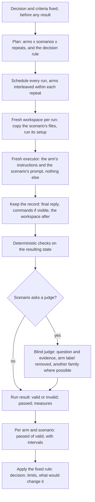
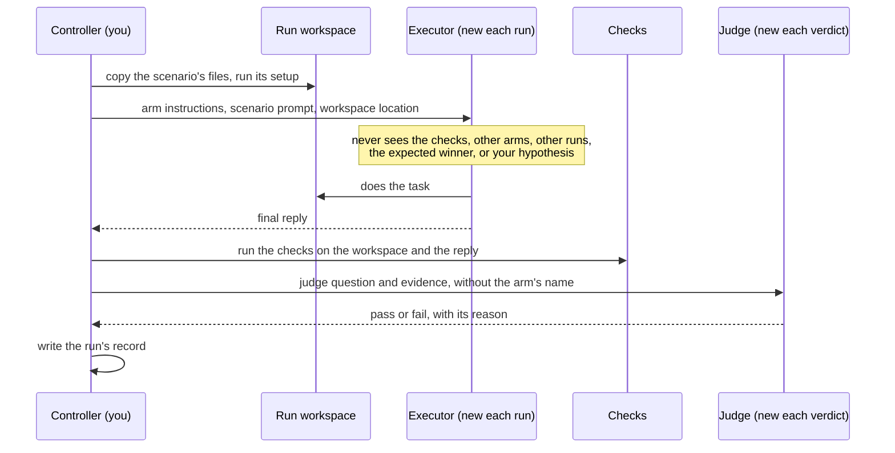

# Trial flow

What a trial does, stage by stage, whoever carries it out. [`scripts/trial.py`](trials.md) carries out this flow when the executors are the Codex, Claude, or Gemini CLI or a shell command. When none of those can run the executors, as on a host that offers its own subagents and code execution, you carry out the same flow with the host's means. Each stage's guarantee is what makes the result a trial; the tool that provides it is interchangeable.

Who sees what in one run:

## Each stage without the runtime

- **Workspace.** Give every run its own fresh copy of the scenario's files, made before the executor starts, outside any repository whose instruction files the executor would load, and holding nothing from another run. [`scripts/prepare_workspaces.py`](workspaces.md) makes such copies and needs only Python. Run the scenario's setup inside the copy.
- **Executor.** Start a new executor for every run, with no inherited conversation, memory, or other instructions. Give it the arm's instruction text as its standing instructions where the host allows that, or otherwise verbatim before the prompt in every arm alike. Give it the scenario's prompt unchanged and the location of its workspace. Keep the checks, the other arms' texts, and other runs' workspaces where it cannot read them if the host can enforce that. Record in the results whatever isolation you could not enforce.
- **Order.** Run every arm on every scenario the same number of times, and interleave the arms within each repeat rather than running one arm's runs in a block.
- **Record.** Keep each run's final reply, the commands it ran when the host shows them, and its workspace as it was left. Every claim in the conclusion traces back to these records.
- **Checks.** Run the checks after the executor finishes, on the workspace and the reply. Never show them to the executor. In this repository's scenarios, `check.py` expects the runtime's `run` object; without the runtime, read what each check asserts and apply the same assertions to the workspace yourself.
- **Judge.** Use a new judge for each verdict, give it the scenario's question and the evidence with the arm's name removed, and prefer another model family than the executor's.
- **Validity.** A run whose executor did not finish, or whose checks or judge could not run, is invalid, not failed. Run it again before reading results, and report any that stay invalid.
- **Aggregate.** For each arm and scenario, count passed of valid runs and give an interval: the 95% Wilson interval for k passes in n runs is (p + z²/2n ± z·√(p(1−p)/n + z²/4n²)) / (1 + z²/n), with p = k/n and z = 1.96. Then apply the rule you fixed before any results.

If Python is available, write each run's record as `runs/<scenario>__<arm>__r<repeat>/result.json` in a directory that also holds a `plan.json` naming the arms and scenarios. Each record is `{"job": "<that directory name>", "arm": ..., "scenario": ..., "repeat": n, "status": "ok", "passed": true or false, "checks": {...}}`, with a `status` other than `"ok"` for an invalid run. Then `python3 scripts/trial.py summarize DIR` gives the counts and intervals; that step needs no executor CLI.
