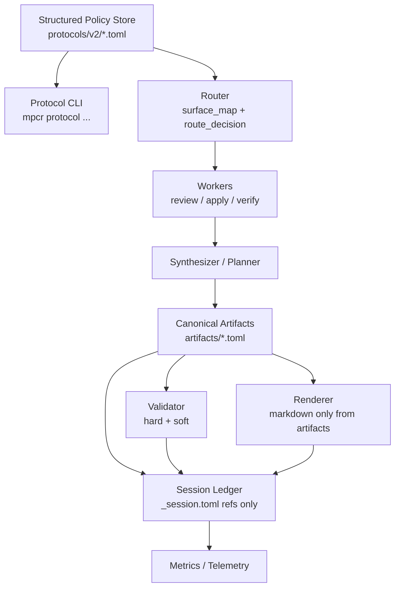
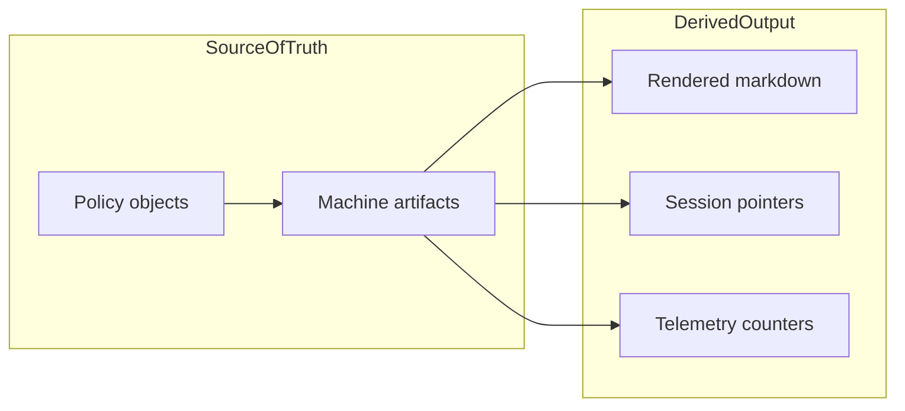

# System Overview

This diagram shows the main moving parts in the v2 design and the direction of data flow.

```mermaid
flowchart TD
    A[Structured Policy Store\nprotocols/v2/*.toml] --> B[Protocol CLI\nmpcr protocol ...]
    A --> C[Router\nsurface_map + route_decision]
    C --> D[Workers\nreview / apply / verify]
    D --> E[Synthesizer / Planner]
    E --> F[Canonical Artifacts\nartifacts/*.toml]
    F --> G[Renderer\nmarkdown only from artifacts]
    F --> H[Validator\nhard + soft]
    F --> I[Session Ledger\n_session.toml refs only]
    I --> J[Metrics / Telemetry]
    H --> I
    G --> I
```

```mermaid
flowchart LR
    subgraph SourceOfTruth
        A1[Policy objects]
        A2[Machine artifacts]
    end

    subgraph DerivedOutput
        B1[Rendered markdown]
        B2[Session pointers]
        B3[Telemetry counters]
    end

    A1 --> A2
    A2 --> B1
    A2 --> B2
    A2 --> B3
```
