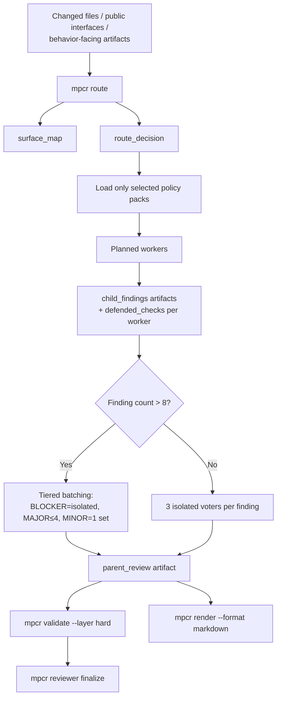
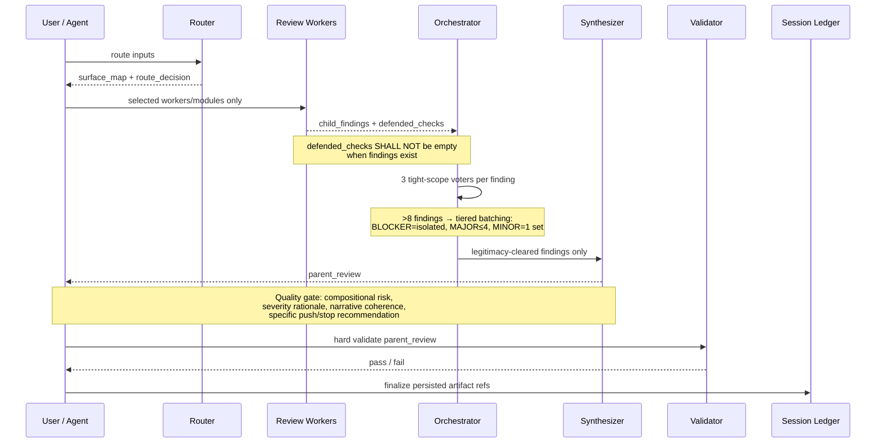

# Reviewer Flow

This is the route-first review path for reviewer mode.

```mermaid
flowchart TD
    A[Changed files / public interfaces /\nbehavior-facing artifacts] --> B[mpcr route]
    B --> C[surface_map]
    B --> D[route_decision]
    D --> E[Load only selected policy packs]
    E --> F[Planned workers]
    F --> G[child_findings artifacts\n+ defended_checks per worker]
    G --> H{Finding count > 8?}
    H -- Yes --> H1[Tiered batching:\nBLOCKER=isolated, MAJOR≤4, MINOR=1 set]
    H -- No --> H2[3 isolated voters per finding]
    H1 --> I[parent_review artifact]
    H2 --> I
    I --> J[mpcr validate --layer hard]
    J --> K[mpcr reviewer finalize]
    I --> L[mpcr render --format markdown]
```

```mermaid
sequenceDiagram
    participant U as User / Agent
    participant R as Router
    participant W as Review Workers
    participant O as Orchestrator
    participant S as Synthesizer
    participant V as Validator
    participant L as Session Ledger

    U->>R: route inputs
    R-->>U: surface_map + route_decision
    U->>W: selected workers/modules only
    W-->>O: child_findings + defended_checks
    Note over W,O: defended_checks SHALL NOT be empty<br/>when findings exist
    O->>O: 3 tight-scope voters per finding
    Note over O: >8 findings → tiered batching:<br/>BLOCKER=isolated, MAJOR≤4, MINOR=1 set
    O->>S: legitimacy-cleared findings only
    S-->>U: parent_review
    Note over S,U: Quality gate: compositional risk,<br/>severity rationale, narrative coherence,<br/>specific push/stop recommendation
    U->>V: hard validate parent_review
    V-->>U: pass / fail
    U->>L: finalize persisted artifact refs
```
