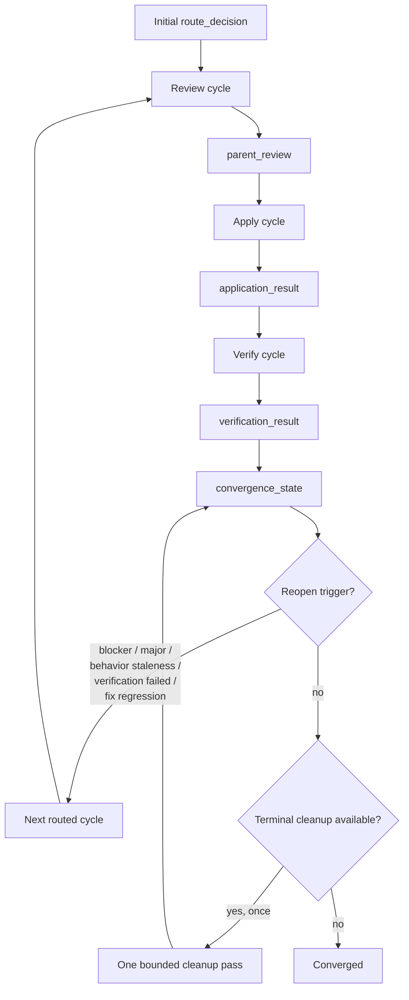
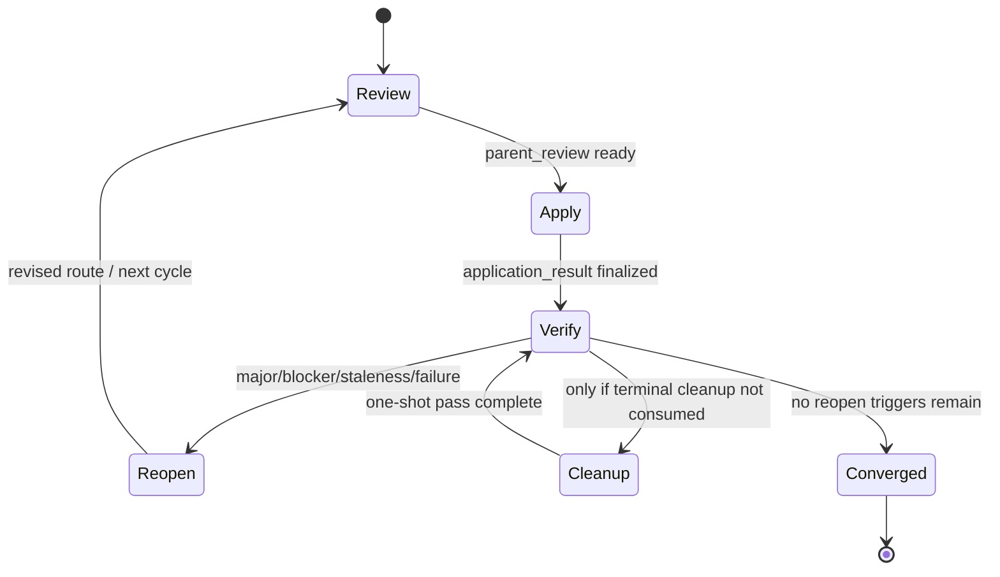

# Full-Cycle Convergence

This is the bounded review -> apply -> verify -> reopen loop.

```mermaid
flowchart TD
    A[Initial route_decision] --> B[Review cycle]
    B --> C[parent_review]
    C --> D[Apply cycle]
    D --> E[application_result]
    E --> F[Verify cycle]
    F --> G[verification_result]
    G --> H[convergence_state]
    H --> I{Reopen trigger?}
    I -->|blocker / major /\nbehavior staleness /\nverification failed /\nfix regression| J[Next routed cycle]
    I -->|no| K{Terminal cleanup available?}
    K -->|yes, once| L[One bounded cleanup pass]
    K -->|no| M[Converged]
    L --> H
    J --> B
```

```mermaid
stateDiagram-v2
    [*] --> Review
    Review --> Apply: parent_review ready
    Apply --> Verify: application_result finalized
    Verify --> Reopen: major/blocker/staleness/failure
    Verify --> Cleanup: only if terminal cleanup not consumed
    Cleanup --> Verify: one-shot pass complete
    Verify --> Converged: no reopen triggers remain
    Reopen --> Review: revised route / next cycle
    Converged --> [*]
```
