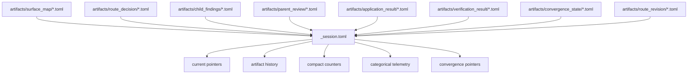
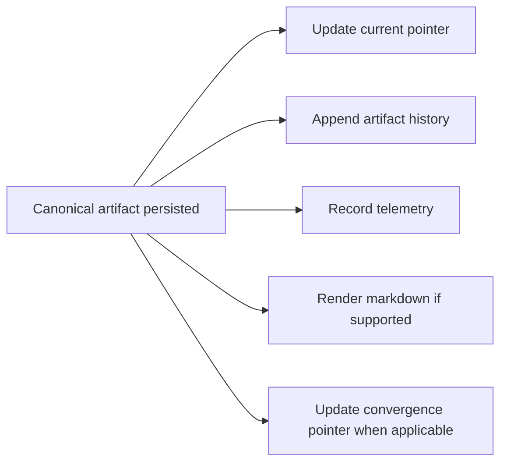
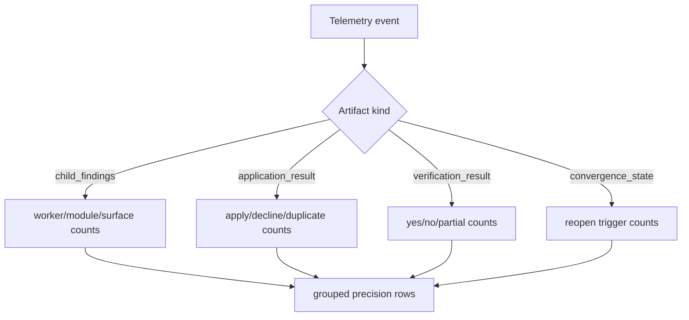

# Session Ledger And Storage

The ledger stays compact and points at canonical artifacts stored as separate files.

```mermaid
flowchart TD
    A[_session.toml] --> B[current pointers]
    A --> C[artifact history]
    A --> D[compact counters]
    A --> E[categorical telemetry]
    A --> F[convergence pointers]

    G[artifacts/surface_map/*.toml] --> A
    H[artifacts/route_decision/*.toml] --> A
    I[artifacts/child_findings/*.toml] --> A
    J[artifacts/parent_review/*.toml] --> A
    K[artifacts/application_result/*.toml] --> A
    L[artifacts/verification_result/*.toml] --> A
    M[artifacts/convergence_state/*.toml] --> A
    N[artifacts/route_revision/*.toml] --> A
```

```mermaid
flowchart LR
    A[Canonical artifact persisted] --> B[Update current pointer]
    A --> C[Append artifact history]
    A --> D[Record telemetry]
    A --> E[Render markdown if supported]
    A --> F[Update convergence pointer when applicable]
```

```mermaid
flowchart TD
    A[Telemetry event] --> B{Artifact kind}
    B -->|child_findings| C[worker/module/surface counts]
    B -->|application_result| D[apply/decline/duplicate counts]
    B -->|verification_result| E[yes/no/partial counts]
    B -->|convergence_state| F[reopen trigger counts]
    C --> G[grouped precision rows]
    D --> G
    E --> G
    F --> G
```
