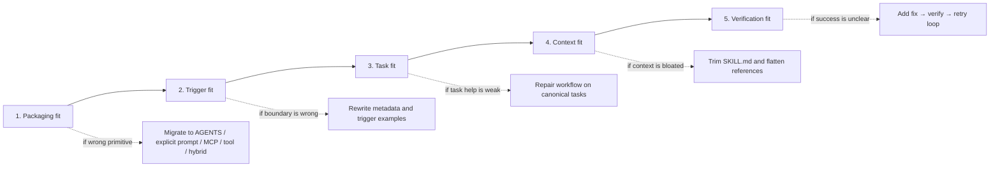

# Five-Question Order

```mermaid
flowchart LR
    A[1. Packaging fit] --> B[2. Trigger fit]
    B --> C[3. Task fit]
    C --> D[4. Context fit]
    D --> E[5. Verification fit]

    A -.if wrong primitive.-> X[Migrate to AGENTS / explicit prompt / MCP / tool / hybrid]
    B -.if boundary is wrong.-> Y[Rewrite metadata and trigger examples]
    C -.if task help is weak.-> Z[Repair workflow on canonical tasks]
    D -.if context is bloated.-> U[Trim SKILL.md and flatten references]
    E -.if success is unclear.-> V[Add fix → verify → retry loop]
```
