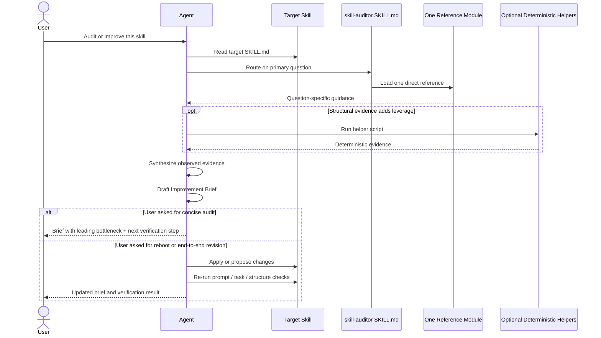

# Improvement Loop

```mermaid
sequenceDiagram
    actor User
    participant Agent
    participant Target as Target Skill
    participant Router as skill-auditor SKILL.md
    participant Ref as One Reference Module
    participant Helpers as Optional Deterministic Helpers

    User->>Agent: Audit or improve this skill
    Agent->>Target: Read target SKILL.md
    Agent->>Router: Route on primary question
    Router->>Ref: Load one direct reference
    Ref-->>Agent: Question-specific guidance

    opt Structural evidence adds leverage
        Agent->>Helpers: Run helper script
        Helpers-->>Agent: Deterministic evidence
    end

    Agent->>Agent: Synthesize observed evidence
    Agent->>Agent: Draft Improvement Brief
    alt User asked for concise audit
        Agent-->>User: Brief with leading bottleneck + next verification step
    else User asked for reboot or end-to-end revision
        Agent->>Target: Apply or propose changes
        Agent->>Target: Re-run prompt / task / structure checks
        Agent-->>User: Updated brief and verification result
    end
```
