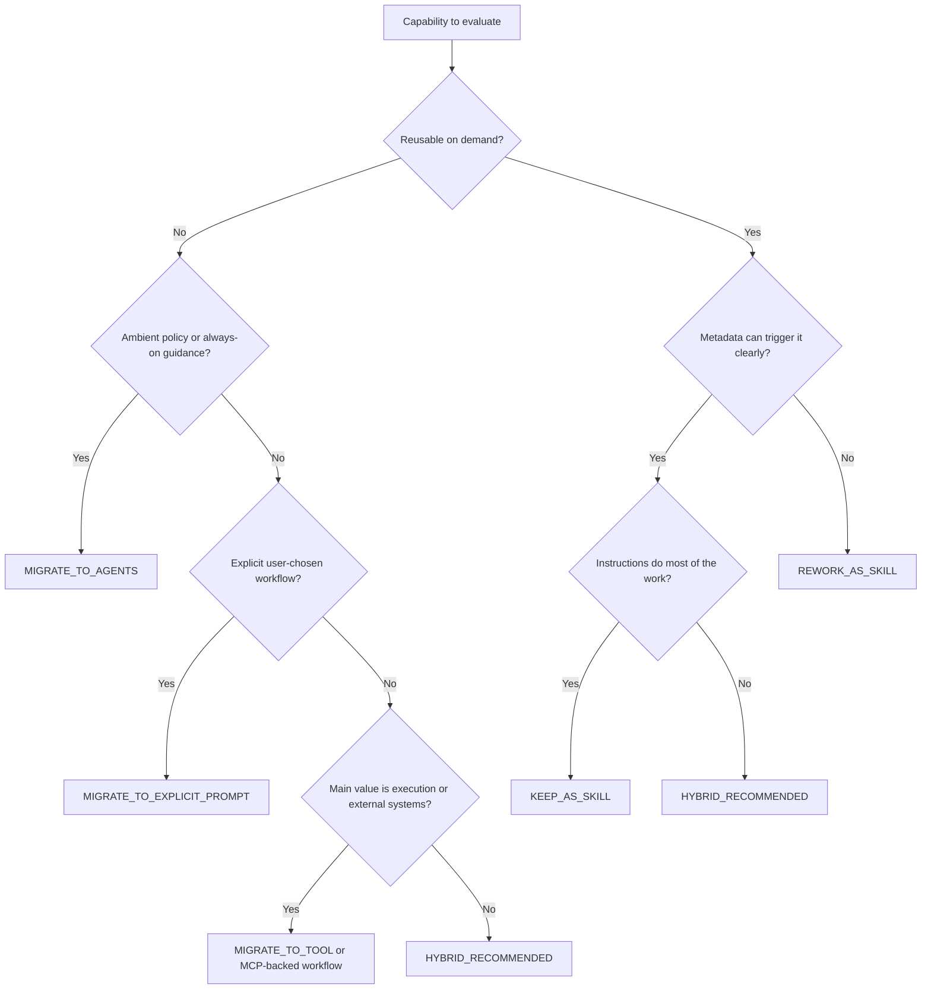

# Packaging Decisions

```mermaid
flowchart TD
    A[Capability to evaluate] --> B{Reusable on demand?}

    B -->|No| C{Ambient policy or always-on guidance?}
    C -->|Yes| D[MIGRATE_TO_AGENTS]
    C -->|No| E{Explicit user-chosen workflow?}
    E -->|Yes| F[MIGRATE_TO_EXPLICIT_PROMPT]
    E -->|No| G{Main value is execution or external systems?}
    G -->|Yes| H[MIGRATE_TO_TOOL or MCP-backed workflow]
    G -->|No| I[HYBRID_RECOMMENDED]

    B -->|Yes| J{Metadata can trigger it clearly?}
    J -->|Yes| K{Instructions do most of the work?}
    K -->|Yes| L[KEEP_AS_SKILL]
    K -->|No| M[HYBRID_RECOMMENDED]
    J -->|No| N[REWORK_AS_SKILL]
```
