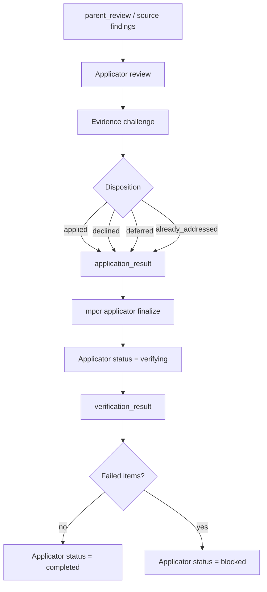
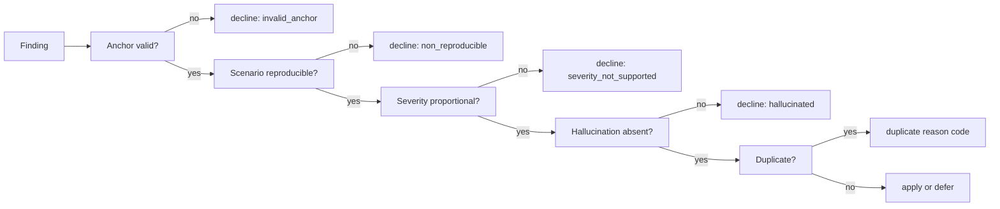

# Applicator Flow

This shows how findings move through application and verification.

```mermaid
flowchart TD
    A[parent_review / source findings] --> B[Applicator review]
    B --> C[Evidence challenge]
    C --> D{Disposition}
    D -->|applied| E[application_result]
    D -->|declined| E
    D -->|deferred| E
    D -->|already_addressed| E
    E --> F[mpcr applicator finalize]
    F --> G[Applicator status = verifying]
    G --> H[verification_result]
    H --> I{Failed items?}
    I -->|no| J[Applicator status = completed]
    I -->|yes| K[Applicator status = blocked]
```

```mermaid
flowchart LR
    A[Finding] --> B[Anchor valid?]
    B -->|no| X[decline: invalid_anchor]
    B -->|yes| C[Scenario reproducible?]
    C -->|no| Y[decline: non_reproducible]
    C -->|yes| D[Severity proportional?]
    D -->|no| Z[decline: severity_not_supported]
    D -->|yes| E[Hallucination absent?]
    E -->|no| H[decline: hallucinated]
    E -->|yes| F[Duplicate?]
    F -->|yes| I[duplicate reason code]
    F -->|no| G[apply or defer]
```
