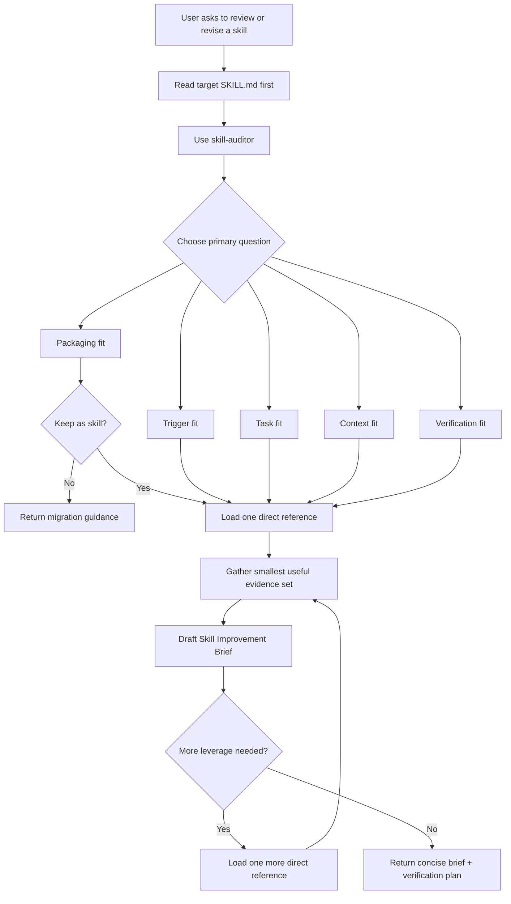

# System Overview

```mermaid
flowchart TD
    A[User asks to review or revise a skill] --> B[Read target SKILL.md first]
    B --> C[Use skill-auditor]
    C --> D{Choose primary question}

    D --> E[Packaging fit]
    D --> F[Trigger fit]
    D --> G[Task fit]
    D --> H[Context fit]
    D --> I[Verification fit]

    E --> J{Keep as skill?}
    J -->|No| K[Return migration guidance]
    J -->|Yes| L[Load one direct reference]

    F --> L
    G --> L
    H --> L
    I --> L

    L --> M[Gather smallest useful evidence set]
    M --> N[Draft Skill Improvement Brief]
    N --> O{More leverage needed?}
    O -->|Yes| P[Load one more direct reference]
    P --> M
    O -->|No| Q[Return concise brief + verification plan]
```
