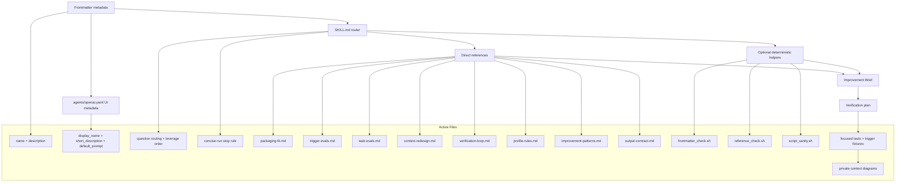

# Active Skill Surface

```mermaid
flowchart TB
    A[Frontmatter metadata] --> B[SKILL.md router]
    A --> G[agents/openai.yaml UI metadata]
    B --> C[Direct references]
    B --> D[Optional deterministic helpers]
    C --> E[Improvement Brief]
    D --> E
    E --> F[Verification plan]

    subgraph Active Files
        A1[name + description]
        G1[display_name + short_description + default_prompt]
        B1[question routing + leverage order]
        B2[concise-run stop rule]
        C1[packaging-fit.md]
        C2[trigger-evals.md]
        C3[task-evals.md]
        C4[context-redesign.md]
        C5[verification-loop.md]
        C6[profile-rules.md]
        C7[improvement-patterns.md]
        C8[output-contract.md]
        D1[frontmatter_check.sh]
        D2[reference_check.sh]
        D3[script_sanity.sh]
        T[focused tests + trigger fixtures]
        X[private context diagrams]
    end

    A --> A1
    G --> G1
    B --> B1
    B --> B2
    C --> C1
    C --> C2
    C --> C3
    C --> C4
    C --> C5
    C --> C6
    C --> C7
    C --> C8
    D --> D1
    D --> D2
    D --> D3
    F --> T
    T --> X
```
